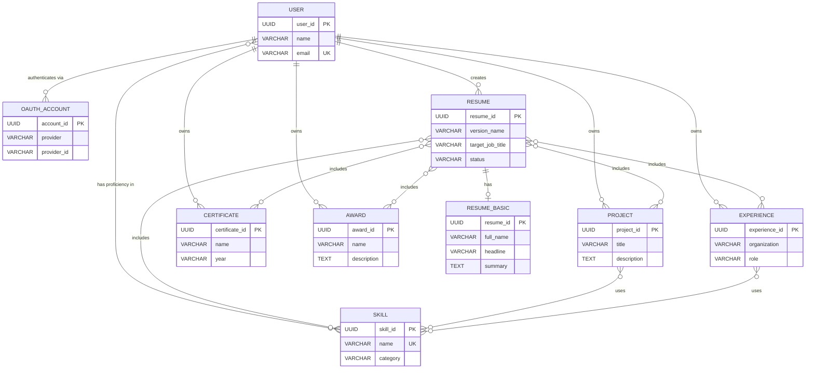
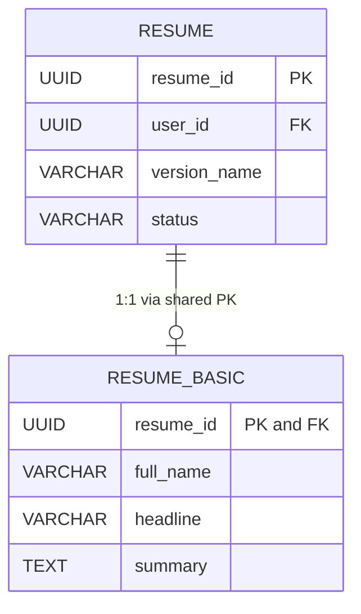
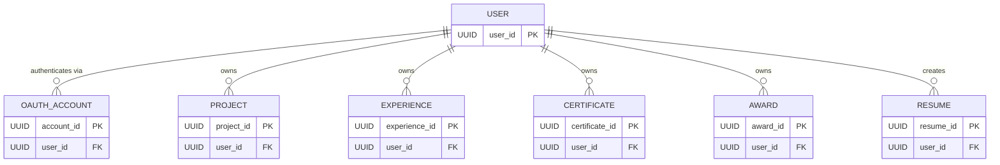

# Database Design Document

> **Project:** Universal Academic Portfolio System (UAPS)  
> **Module:** Resume Vault & Resume Builder  
> **Database Engine:** PostgreSQL 17  
> **ORM:** Prisma  
> **Author:** Anothai Vichapaiboon  
> **Document Version:** 1.0  
> **Last Updated:** 2026-06-13

---

## Chapter 1 — Project Overview & Requirement Analysis

### 1.1 Project Purpose

The Universal Academic Portfolio System (UAPS) is a web application that allows users to store their professional portfolio data — skills, projects, work experiences, certificates, and awards — in a centralized personal vault. From this vault, users can compose multiple tailored resumes, each targeting a specific job title or company, by selecting which vault items to include.

The system solves a common problem: professionals maintain a single resume and manually copy-paste content when applying for different positions. UAPS eliminates this by separating the **data storage** (vault) from the **data presentation** (resume), allowing users to maintain one source of truth and generate multiple targeted outputs.

### 1.2 Main Users

The system has a single primary user role:

- **Portfolio Owner** — A person who registers via OAuth (GitHub, Google, etc.), manages their vault data, and composes resumes.

The system enforces **multi-user data isolation**: each user can only view and modify their own data. There is no admin role or cross-user data access in the current scope.

### 1.3 Major Features and Data Requirements

Each feature is traced to a business rule and its resulting data impact.

---

**Feature 1: User Registration and Authentication**

A user registers by signing in through an external OAuth provider such as GitHub or Google. The system creates or links a user account based on their email address.

> **Business Rule:** One user account is identified by a unique email address. A single user may link multiple OAuth providers (e.g., both GitHub and Google) to the same account.
>
> **Data Impact:** Two entities are required — **User** to represent the account, and **OAuthAccount** to store each linked provider. The relationship is 1:N (one user has many OAuth accounts).

---

**Feature 2: Skills Vault**

Users maintain a personal list of skills (e.g., TypeScript, PostgreSQL, Docker) with a self-assessed proficiency level. Skills are selected from a shared system-wide catalog.

> **Business Rule:** Skills are shared across all users — if "TypeScript" exists in the catalog, every user selects the same record. Each user records their own proficiency level for each skill they add.
>
> **Data Impact:** Two entities — **Skill** (shared catalog) and a relationship between User and Skill. Since one user can have many skills and one skill can belong to many users, this is an M:N relationship. The proficiency level is an attribute of the relationship itself, not of either entity.

---

**Feature 3: Projects Vault**

Users add portfolio projects with a title, description, repository URL, and associated skills.

> **Business Rule:** Each project belongs to exactly one user. A project can be tagged with zero or more skills from the shared catalog.
>
> **Data Impact:** A **Project** entity owned by User (1:N), plus an M:N relationship between Project and Skill to represent skill tagging.

---

**Feature 4: Experiences Vault**

Users record work experiences including organization name, role, dates, description, and achievements. Each experience can be tagged with relevant skills.

> **Business Rule:** Each experience belongs to exactly one user. Start and end dates are optional to allow "ongoing" positions.
>
> **Data Impact:** An **Experience** entity owned by User (1:N), plus an M:N relationship between Experience and Skill.

---

**Feature 5: Certificates Vault**

Users record professional certificates with a name and year of completion.

> **Business Rule:** Each certificate belongs to exactly one user.
>
> **Data Impact:** A **Certificate** entity owned by User (1:N).

---

**Feature 6: Awards Vault**

Users record awards and honors with a name and description.

> **Business Rule:** Each award belongs to exactly one user. Every award must have a description.
>
> **Data Impact:** An **Award** entity owned by User (1:N).

---

**Feature 7: Resume Composition**

Users create multiple resume versions. Each resume targets a specific job title and company. The user selects which projects, skills, experiences, certificates, and awards to include in each resume from their vault.

> **Business Rule:** One user can create many resumes. Each resume is assembled by **selecting** existing vault items — data is not duplicated. The same project can appear in multiple resumes, and a single resume can include multiple projects.
>
> **Data Impact:** A **Resume** entity owned by User (1:N). Five M:N relationships are required to link Resume with each vault entity: Resume–Project, Resume–Skill, Resume–Experience, Resume–Certificate, Resume–Award.

---

**Feature 8: Resume Basic Information**

Each resume has a header section containing the person's full name, headline, contact information, and a profile summary. This information can differ between resume versions (e.g., a different phone number or summary for different applications).

> **Business Rule:** Each resume has at most one set of basic information. A resume may exist without basic information (in draft state).
>
> **Data Impact:** A **ResumeBasic** entity with a 1:1 relationship to Resume. ResumeBasic cannot exist independently — it depends on a specific Resume for its identity.

---

### 1.4 Requirement Summary

| ID  | Requirement                                  | Entities Involved                                            | Relationship         |
| --- | -------------------------------------------- | ------------------------------------------------------------ | -------------------- |
| R1  | User registration via OAuth                  | User, OAuthAccount                                           | 1:N                  |
| R2  | Manage personal skills with proficiency      | User, Skill                                                  | M:N (with attribute) |
| R3  | Manage portfolio projects tagged with skills | User, Project, Skill                                         | 1:N + M:N            |
| R4  | Manage work experiences tagged with skills   | User, Experience, Skill                                      | 1:N + M:N            |
| R5  | Manage certificates                          | User, Certificate                                            | 1:N                  |
| R6  | Manage awards                                | User, Award                                                  | 1:N                  |
| R7  | Compose resumes from vault items             | User, Resume, Project, Skill, Experience, Certificate, Award | 1:N + five M:N       |
| R8  | Resume header/contact information            | Resume, ResumeBasic                                          | 1:1                  |

---

### 1.5 Assumptions

The following assumptions are accepted as true for this database design:

1. **One user = one email.** A user account is uniquely identified by their email address. Two different people cannot share the same email.
2. **Email is the identity anchor across OAuth providers.** If a user logs in with GitHub (email: a@b.com) and later with Google (same email), both providers link to the same User record.
3. **Skill names are globally unique.** There is exactly one "TypeScript" in the system. The Skill catalog is shared across all users.
4. **Each vault item belongs to exactly one user.** A project, experience, certificate, or award cannot be shared between users.
5. **Resumes reference vault data, not copy it.** Changing a project title in the vault affects all resumes that include that project.
6. **All primary keys are server-generated UUIDs.** The application never accepts client-generated IDs.
7. **Timestamps are stored in UTC.** Timezone conversion is handled by the frontend.

### 1.6 Limitations

The following features are intentionally **not** supported in the current database design:

1. **No resume sharing between users.** A resume belongs to exactly one user. There is no collaborative editing or sharing mechanism.
2. **No soft delete.** Deleted records are permanently removed from the database. There is no `deleted_at` column or trash/archive functionality.
3. **No versioning history.** When a user edits a project or experience, the previous version is overwritten. There is no change log or revision history.
4. **No file/image storage.** The database stores URLs (e.g., `avatar_url`, `repo_url`) but does not store binary files. File hosting is external.
5. **No role-based access control.** There is only one user role (Portfolio Owner). There is no admin, reviewer, or viewer role.
6. **No skill hierarchy.** Skills are flat — there is no parent-child relationship (e.g., "JavaScript" is not a parent of "TypeScript").

---

## Chapter 2 — Conceptual Database Design

This chapter identifies what information the system needs to store, organized by data category, before considering implementation details like data types or table structures.

### 2.1 Master Data

Master data represents reference information that is shared across users and changes infrequently.

#### Skill

**Related UI:** When a user adds a skill to their vault, tags a project with skills, or tags an experience with skills, they select from a system-wide skill catalog (e.g., a dropdown or search component).

**Business Purpose:** The Skill entity exists as a shared catalog so that skill names are consistent across users. Without this, one user might type "TypeScript" while another types "typescript" or "TS", making aggregation or search impossible.

**Entity:** Skill

**Attributes:**
- skill_id — unique identifier
- name — the display name of the skill (globally unique)
- category — classification such as "Programming Language", "Framework", "Database"

**Relationships:**
- M:N with User (through user_skills, with proficiency level)
- M:N with Project (through project_skills)
- M:N with Experience (through experience_skills)
- M:N with Resume (through resume_skills)

---

### 2.2 Operational / Transaction Data

Operational data is created, modified, and deleted through user actions.

#### User

**Related UI:** The user is created automatically upon first OAuth login. The user's name and avatar appear in the dashboard header.

**Business Purpose:** Represents the account owner. All vault data and resumes are scoped to a single user. The email address serves as the cross-provider identity anchor — if a user logs in with GitHub and later with Google using the same email, both providers link to the same User record.

**Entity:** User

**Attributes:**
- user_id — unique identifier
- name — display name
- email — unique login identity
- github_url, github_id, github_login — legacy GitHub-specific fields (retained for backward compatibility)
- avatar_url — profile picture URL
- created_at, updated_at — audit timestamps

**Relationships:**
- 1:N with OAuthAccount, Project, Experience, Certificate, Award, Resume
- M:N with Skill

---

#### OAuthAccount

**Related UI:** The login page displays buttons for each OAuth provider (GitHub, Google, Discord, Line, Facebook, Instagram). Each linked provider appears in the user's profile.

**Business Purpose:** Stores the credentials for each external OAuth provider linked to a user account. The system is designed to be provider-agnostic — adding a new OAuth provider requires no schema changes, only a new row with a different provider name.

**Entity:** OAuthAccount

**Attributes:**
- account_id — unique identifier
- user_id — which user this account belongs to
- provider — the provider name (e.g., "github", "google")
- provider_id — the user's unique ID within that provider
- provider_login — the username on that provider
- profile_url — link to the user's profile on that provider
- avatar_url — profile picture from that provider
- created_at, updated_at — audit timestamps

**Relationships:**
- N:1 with User (many OAuth accounts belong to one user)

---

#### Project

**Related UI:** The vault page where users create and edit portfolio projects. Each project card shows title, description, skills used, and repository link.

**Business Purpose:** Represents a piece of work the user wants to showcase. Projects can be tagged with skills to indicate technologies used, and can be selected into one or more resumes.

**Entity:** Project

**Attributes:**
- project_id — unique identifier
- user_id — owner
- title — project name
- description — what the project does
- repo_url — link to source code
- is_active — whether the project is currently maintained
- status — project lifecycle state (e.g., "Completed")
- created_at, updated_at

**Relationships:**
- N:1 with User
- M:N with Skill (skill tagging)
- M:N with Resume (resume composition)

---

#### Experience

**Related UI:** The vault page where users record work experiences. Each entry shows organization, role, date range, and skills used.

**Business Purpose:** Represents a work or volunteer position. Experiences can be tagged with relevant skills and included in resumes.

**Entity:** Experience

**Attributes:**
- experience_id — unique identifier
- user_id — owner
- organization — company or institution name
- role — job title or position
- description — responsibilities
- achievement — notable accomplishments
- start_date — when the position began (optional, for ongoing positions)
- end_date — when it ended (optional)
- created_at, updated_at

**Relationships:**
- N:1 with User
- M:N with Skill
- M:N with Resume

---

#### Certificate

**Related UI:** The vault page where users add certifications.

**Business Purpose:** Records professional certifications obtained by the user.

**Entity:** Certificate

**Attributes:**
- certificate_id — unique identifier
- user_id — owner
- name — certificate title
- year — year of completion (stored as text, e.g., "2024")
- created_at, updated_at

**Relationships:**
- N:1 with User
- M:N with Resume

---

#### Award

**Related UI:** The vault page where users add awards and honors.

**Business Purpose:** Records awards or recognitions. Unlike Certificate, every Award requires a description explaining the achievement.

**Entity:** Award

**Attributes:**
- award_id — unique identifier
- user_id — owner
- name — award title
- description — what was recognized (required)
- created_at, updated_at

**Relationships:**
- N:1 with User
- M:N with Resume

---

#### Resume

**Related UI:** The resume builder page where users create and manage resume versions. Each resume shows a version name, target job, and allows selecting vault items.

**Business Purpose:** Represents a tailored resume version. The user can create multiple resumes targeting different positions. Each resume is composed by selecting items from the vault — it does not duplicate vault data but references it.

**Entity:** Resume

**Attributes:**
- resume_id — unique identifier
- user_id — owner
- version_name — user-friendly label (e.g., "Frontend Dev @ Google v2")
- target_job_title — the position this resume targets
- target_company — the company this resume targets
- visibility — access control ("private" or "public")
- profile_summary — brief personal statement
- location, phone, linkedin_url, portfolio_url — contact information
- is_active — whether this is the primary active resume
- status — lifecycle state ("Draft", "Active", "Archived")
- created_at, updated_at

**Relationships:**
- N:1 with User
- 1:1 with ResumeBasic
- M:N with Project, Skill, Experience, Certificate, Award

---

#### ResumeBasic

**Related UI:** The header section of the resume builder — name, headline, email, phone, summary.

**Business Purpose:** Stores presentation-level contact and profile information specific to one resume. This is separated from Resume because the same person may want to present different headlines, summaries, or contact details for different applications. ResumeBasic cannot exist without a parent Resume — it depends on Resume for its identity.

**Entity:** ResumeBasic

**Attributes:**
- resume_id — unique identifier (same as the parent resume's ID)
- full_name — display name on the resume
- headline — professional title or tagline
- email, phone, location — contact info
- linkedin_url, portfolio_url, github_url — social links
- summary — personal statement
- created_at, updated_at

**Relationships:**
- 1:1 with Resume (total participation on ResumeBasic side)

---

### 2.3 Conceptual ER Diagram

The following diagram shows all entities, their relationships, and cardinalities at the conceptual level. No implementation details (data types, foreign keys) are shown.



---

## Chapter 3 — Logical Database Design

This chapter transforms the conceptual ER model into relational structures. Each mapping step explains what transformation is applied and why.

### 3.1 Mapping Strong (Regular) Entities

A strong entity is one that has its own independent primary key and does not depend on another entity for its existence. Each strong entity maps directly to one relation (table).

---

**Entity: User**

The User entity represents a registered account owner. It has a natural candidate key (email) but uses a surrogate UUID as the primary key for consistency and to avoid exposing sensitive data in URLs.

> **Transformation:** User entity → `users` relation
>
> **Result:** `users(user_id, name, email, github_url, github_id, github_login, avatar_url, created_at, updated_at)`

---

**Entity: Skill**

The Skill entity represents a shared skill catalog entry. It has a natural candidate key (name) and a surrogate primary key (skill_id).

> **Transformation:** Skill entity → `skills` relation
>
> **Result:** `skills(skill_id, name, category)`

---

**Entity: OAuthAccount**

The OAuthAccount entity stores linked external authentication providers. The combination (provider, provider_id) is a natural key, but a surrogate UUID is used as the primary key for simplicity.

> **Transformation:** OAuthAccount entity → `oauth_accounts` relation
>
> **Result:** `oauth_accounts(account_id, user_id, provider, provider_id, provider_login, profile_url, avatar_url, created_at, updated_at)`

---

**Entity: Project**

> **Transformation:** Project entity → `projects` relation
>
> **Result:** `projects(project_id, user_id, title, description, repo_url, is_active, status, created_at, updated_at)`

---

**Entity: Experience**

> **Transformation:** Experience entity → `experiences` relation
>
> **Result:** `experiences(experience_id, user_id, organization, role, description, achievement, start_date, end_date, created_at, updated_at)`

---

**Entity: Certificate**

> **Transformation:** Certificate entity → `certificates` relation
>
> **Result:** `certificates(certificate_id, user_id, name, year, created_at, updated_at)`

---

**Entity: Award**

> **Transformation:** Award entity → `awards` relation
>
> **Result:** `awards(award_id, user_id, name, description, created_at, updated_at)`

---

**Entity: Resume**

> **Transformation:** Resume entity → `resumes` relation
>
> **Result:** `resumes(resume_id, user_id, version_name, target_job_title, target_company, visibility, profile_summary, location, phone, linkedin_url, portfolio_url, is_active, status, created_at, updated_at)`

---

### 3.2 Mapping Weak Entities

In relational database theory, a **weak entity** is an entity type that cannot be uniquely identified by its own attributes alone. It relies on a **identifying relationship** (also called an **owner** or **parent** entity) to form its primary key. A weak entity exhibits two defining properties:

1. **Existence dependency** — the weak entity cannot exist in the database without a corresponding owner entity row.
2. **Identification dependency** — the weak entity's primary key includes (or equals) the primary key of its owner entity.

The standard mapping technique is to use the owner entity's primary key as the weak entity's primary key (or as part of it), simultaneously serving as a foreign key with `ON DELETE CASCADE`.

**Entity: ResumeBasic (Weak Entity)**

ResumeBasic satisfies both criteria for a weak entity:

- **Existence dependency:** A ResumeBasic row cannot exist without a corresponding Resume row. If the Resume is deleted, the associated ResumeBasic is automatically removed via CASCADE.
- **Identification dependency:** ResumeBasic has no independent primary key. Its sole identifier (`resume_id`) is borrowed from its owner entity (Resume). This column simultaneously functions as the primary key of `resume_basics` and a foreign key referencing `resumes(resume_id)`.

This shared-PK technique also enforces a strict **1:1 cardinality constraint** at the database level: since `resume_id` is the primary key of `resume_basics`, at most one row can exist per resume — no additional UNIQUE constraint or application logic is required.

> **Owner entity:** Resume (strong entity)
>
> **Identifying relationship:** ResumeBasic is identified by the Resume it belongs to.
>
> **Transformation:** ResumeBasic weak entity → `resume_basics` relation
>
> **Result:** `resume_basics(resume_id, full_name, headline, email, phone, location, linkedin_url, portfolio_url, github_url, summary, created_at, updated_at)` where `resume_id` is both PK and FK referencing `resumes(resume_id)` with ON DELETE CASCADE.

---

### 3.3 Mapping Multivalued Attributes

In ER modeling, a **multivalued attribute** is an attribute that can hold multiple values for a single entity instance (e.g., a person having multiple phone numbers). The standard mapping technique is to create a separate relation whose primary key includes the owner entity's PK plus the attribute value.

**Not applicable to this project.**

All attributes in every entity are **single-valued** (atomic). Concepts that might initially appear multivalued — such as a user having multiple skills — are modeled as **separate entities with M:N relationships** (User ↔ Skill) rather than as multivalued attributes of the User entity. This is the preferred approach when the "multi-valued" data has its own identity and attributes (e.g., each Skill has a `name` and `category`).

Similarly, a user having multiple projects, experiences, certificates, or awards is modeled via 1:N relationships to independent entities, not as multivalued attributes. This distinction is important: a multivalued attribute would produce a dependent table with no independent identity, whereas our entities (Project, Experience, etc.) are strong entities with their own surrogate primary keys.

---

### 3.4 Mapping 1:1 Relationships

In relational design, a **1:1 (one-to-one) relationship** connects two entity types such that each instance of one entity is associated with at most one instance of the other. The key design decision is **where to place the foreign key**, which depends on the **participation constraints** of each side.

**Resume ↔ ResumeBasic (1:1)**

The relationship between Resume and ResumeBasic is one-to-one: each resume has at most one basic information record, and each basic information record belongs to exactly one resume.

The **participation constraints** are:
- **Resume side — partial participation:** A Resume can exist without a ResumeBasic (e.g., a newly created draft). Not every Resume entity participates in this relationship.
- **ResumeBasic side — total participation:** A ResumeBasic cannot exist without a Resume. Every ResumeBasic entity must participate in this relationship.

Following the standard ER-to-relational mapping rule for 1:1 relationships: **the foreign key is placed on the side with total participation** (ResumeBasic). Since ResumeBasic is also a weak entity (§3.2), the foreign key (`resume_id`) doubles as the primary key — this is the canonical technique for enforcing a strict 1:1 cardinality constraint at the schema level, without relying on application logic or additional UNIQUE constraints.

> **Result:** The `resume_id` column in `resume_basics` is simultaneously:
> - The primary key of `resume_basics`
> - A foreign key referencing `resumes(resume_id)`

The following diagram illustrates how the shared primary key enforces the 1:1 constraint:



> **Reading this diagram:** The `resume_id` in `resume_basics` is both the primary key and a foreign key to `resumes`. The `||--o|` notation indicates Resume has partial participation (can exist without ResumeBasic) while ResumeBasic has total participation (cannot exist alone).

---

### 3.5 Mapping 1:N Relationships

A 1:N relationship is mapped by placing a foreign key in the relation on the "many" side, pointing to the primary key of the relation on the "one" side.

The User entity is the central hub of ownership. All vault data and resumes belong to exactly one user. The following diagram shows the complete 1:N ownership structure:



> **Key observation:** Every child table contains a `user_id` foreign key (NOT NULL) pointing to `users.user_id` with ON DELETE CASCADE. This is the foundation of multi-user data isolation — every query filters by `user_id`.

---

**User → Project (1:N)**

> **Business Rule:** One user can create many projects. Each project belongs to exactly one user.
>
> **Transformation:** Place `user_id` as a foreign key in the `projects` relation.
>
> **Result:** `projects.user_id` → `users.user_id` (ON DELETE CASCADE)
>
> **Reason:** If a project could exist without an owner, a nullable FK would be appropriate. Since every project must belong to a user, the FK is NOT NULL. CASCADE delete ensures that removing a user account also removes all their projects.

---

**User → Experience (1:N)**

> **Business Rule:** One user can record many work experiences.
>
> **Result:** `experiences.user_id` → `users.user_id` (NOT NULL, ON DELETE CASCADE)

---

**User → Certificate (1:N)**

> **Business Rule:** One user can hold many certificates.
>
> **Result:** `certificates.user_id` → `users.user_id` (NOT NULL, ON DELETE CASCADE)

---

**User → Award (1:N)**

> **Business Rule:** One user can receive many awards.
>
> **Result:** `awards.user_id` → `users.user_id` (NOT NULL, ON DELETE CASCADE)

---

**User → Resume (1:N)**

> **Business Rule:** One user can compose many resumes, each targeting a different position.
>
> **Result:** `resumes.user_id` → `users.user_id` (NOT NULL, ON DELETE CASCADE)

---

**User → OAuthAccount (1:N)**

> **Business Rule:** One user can link multiple OAuth providers (e.g., GitHub and Google simultaneously).
>
> **Result:** `oauth_accounts.user_id` → `users.user_id` (NOT NULL, ON DELETE CASCADE)

---

### 3.6 Mapping M:N Relationships

A many-to-many relationship cannot be directly represented in a relational model because a single foreign key column cannot reference multiple rows. The standard solution is to create a **junction relation** (also called an associative or bridge table) whose primary key is the composite of both foreign keys.

The system has two categories of M:N relationships:

1. **Skill tagging** — User, Project, and Experience each have M:N with Skill
2. **Resume composition** — Resume has M:N with five vault entities

The following diagram shows how conceptual M:N relationships are decomposed into junction tables. Each junction table holds two foreign keys as a composite primary key:

```mermaid
erDiagram
    %% Skill tagging M:N relationships
    USER ||--o{ user_skills : "has"
    SKILL ||--o{ user_skills : "tagged in"
    user_skills {
        UUID user_id PK,FK
        UUID skill_id PK,FK
        VARCHAR proficiency_level
    }

    PROJECT ||--o{ project_skills : "uses"
    SKILL ||--o{ project_skills : "tagged in"
    project_skills {
        UUID project_id PK,FK
        UUID skill_id PK,FK
    }

    EXPERIENCE ||--o{ experience_skills : "uses"
    SKILL ||--o{ experience_skills : "tagged in"
    experience_skills {
        UUID experience_id PK,FK
        UUID skill_id PK,FK
    }

    %% Resume composition M:N relationships
    RESUME ||--o{ resume_projects : "includes"
    PROJECT ||--o{ resume_projects : "selected in"
    resume_projects {
        UUID resume_id PK,FK
        UUID project_id PK,FK
    }

    RESUME ||--o{ resume_skills : "includes"
    SKILL ||--o{ resume_skills : "selected in"
    resume_skills {
        UUID resume_id PK,FK
        UUID skill_id PK,FK
    }

    RESUME ||--o{ resume_experiences : "includes"
    EXPERIENCE ||--o{ resume_experiences : "selected in"
    resume_experiences {
        UUID resume_id PK,FK
        UUID experience_id PK,FK
    }

    RESUME ||--o{ resume_certificates : "includes"
    CERTIFICATE ||--o{ resume_certificates : "selected in"
    resume_certificates {
        UUID resume_id PK,FK
        UUID certificate_id PK,FK
    }

    RESUME ||--o{ resume_awards : "includes"
    AWARD ||--o{ resume_awards : "selected in"
    resume_awards {
        UUID resume_id PK,FK
        UUID award_id PK,FK
    }
```



> **Key observation:** Only `user_skills` carries an additional attribute (`proficiency_level`). All other junction tables are pure link tables with no extra data — the composite PK is sufficient to record the relationship.

---

**User ↔ Skill (via `user_skills`)**

> **Business Rule:** One user can have many skills, and one skill can belong to many users. Additionally, each user records a **proficiency level** for each skill they possess.
>
> **Why a junction table:** The proficiency level is an attribute of the *relationship* between User and Skill, not of either entity alone. A user's proficiency in "TypeScript" is meaningless without knowing which user — therefore it belongs in the junction.
>
> **Result:** `user_skills(user_id, skill_id, proficiency_level)` — composite PK `(user_id, skill_id)`, with FKs to `users` and `skills`.

---

**Project ↔ Skill (via `project_skills`)**

> **Business Rule:** A project can use multiple skills (technologies), and one skill can appear in many projects.
>
> **Result:** `project_skills(project_id, skill_id)` — composite PK, no additional attributes.

---

**Experience ↔ Skill (via `experience_skills`)**

> **Business Rule:** An experience can involve multiple skills, and one skill can be relevant to many experiences.
>
> **Result:** `experience_skills(experience_id, skill_id)` — composite PK, no additional attributes.

---

**Resume ↔ Project (via `resume_projects`)**

> **Business Rule:** A resume can include multiple projects from the vault, and one project can appear in multiple resumes.
>
> **Result:** `resume_projects(resume_id, project_id)` — composite PK.

---

**Resume ↔ Skill (via `resume_skills`)**

> **Business Rule:** A resume can highlight multiple skills, and one skill can appear in multiple resumes.
>
> **Result:** `resume_skills(resume_id, skill_id)` — composite PK.

---

**Resume ↔ Experience (via `resume_experiences`)**

> **Business Rule:** A resume can include multiple work experiences, and one experience can appear in multiple resumes.
>
> **Result:** `resume_experiences(resume_id, experience_id)` — composite PK.

---

**Resume ↔ Certificate (via `resume_certificates`)**

> **Business Rule:** A resume can list multiple certificates, and one certificate can appear in multiple resumes.
>
> **Result:** `resume_certificates(resume_id, certificate_id)` — composite PK.

---

**Resume ↔ Award (via `resume_awards`)**

> **Business Rule:** A resume can feature multiple awards, and one award can appear in multiple resumes.
>
> **Result:** `resume_awards(resume_id, award_id)` — composite PK.

---

### 3.7 Mapping Recursive (Unary) Relationships

Not applicable to this project.

No entity in the system references itself. There are no hierarchical relationships such as manager–subordinate, category–subcategory, or parent–child within any table.

---

## Chapter 4 — Normalization

This chapter analyzes the key relations to verify they satisfy normal form requirements. The analysis focuses on relations where the reasoning is non-trivial. All-key junction tables (where every column is part of the primary key) are addressed together at the end, since their normalization is straightforward.

### 4.1 Relation: `users`

**Business Rule:** Each user is uniquely identified by a system-generated UUID. Each user has a unique email address. Optionally, a user may have a unique GitHub ID.

**Functional Dependencies:**

```
user_id  → name, email, github_url, github_id, github_login, avatar_url, created_at, updated_at
email    → user_id, name, github_url, github_id, github_login, avatar_url, created_at, updated_at
```

When `github_id` is not null, `github_id → user_id, ...` also holds, but since `github_id` is nullable, it is not a reliable candidate key.

**Candidate Keys:** `{user_id}`, `{email}`

**Primary Key:** `{user_id}` — chosen because a surrogate UUID is stable (email can change) and does not expose personal data in URLs or logs.

**Partial Dependency:** Not possible — the primary key is a single attribute. Partial dependencies only arise with composite keys.

**Transitive Dependency Analysis:** Consider whether any non-key attribute determines another non-key attribute. The attributes `github_url`, `github_id`, and `github_login` might appear related, but they are independently stored fields from the GitHub API — `github_url` is not functionally determined by `github_login` (a user could change their GitHub username without changing their URL format). No transitive dependencies exist.

**Normal Form Result:** The relation is in **3NF**. It also satisfies BCNF because every determinant (`user_id`, `email`) is a candidate key.

---

### 4.2 Relation: `skills`

**Business Rule:** Each skill has a unique name and a category classification.

**Functional Dependencies:**

```
skill_id → name, category
name     → skill_id, category
```

**Candidate Keys:** `{skill_id}`, `{name}`

**Primary Key:** `{skill_id}`

**Partial Dependency:** None (single-attribute PK).

**Transitive Dependency:** Does `name → category` create a transitive path `skill_id → name → category`? Technically yes — but since `name` is itself a candidate key, this is not a 3NF violation (3NF allows non-key → non-key dependencies only if the determinant is not a superkey). Since `name` is a candidate key, this dependency does not violate 3NF or BCNF.

**Normal Form Result:** **BCNF** — every determinant is a candidate key.

---

### 4.3 Relation: `resumes`

**Business Rule:** Each resume belongs to one user and is identified by a system-generated UUID.

**Functional Dependencies:**

```
resume_id → user_id, version_name, target_job_title, target_company, visibility,
            profile_summary, location, phone, linkedin_url, portfolio_url,
            is_active, status, created_at, updated_at
```

**Candidate Keys:** `{resume_id}`

**Primary Key:** `{resume_id}`

**Partial Dependency:** None (single-attribute PK).

**Transitive Dependency Analysis:** Could `target_company → location`? No — the `location` field represents the user's location (e.g., "Bangkok, Thailand"), not the company's location. Could `status → is_active`? In practice, "Active" status might correlate with `is_active = true`, but this is application logic, not a strict functional dependency — a resume can be in "Draft" status with `is_active = false`, or in "Active" status with `is_active = true`, but the mapping is not enforced at the database level. No transitive dependency exists.

**Normal Form Result:** **3NF**. Also satisfies BCNF since the only determinant (`resume_id`) is the sole candidate key.

---

### 4.4 Relation: `oauth_accounts`

**Business Rule:** Each OAuth account links one external provider to one user. The combination of provider name and provider-side user ID is unique.

**Functional Dependencies:**

```
account_id            → user_id, provider, provider_id, provider_login, profile_url, avatar_url, created_at, updated_at
(provider, provider_id) → account_id, user_id, provider_login, profile_url, avatar_url, created_at, updated_at
```

**Candidate Keys:** `{account_id}`, `{provider, provider_id}`

**Primary Key:** `{account_id}` — a surrogate UUID, chosen for simplicity over the composite natural key.

**Partial Dependency:** None — the primary key is a single attribute.

**Transitive Dependency:** None — `provider_login`, `profile_url`, and `avatar_url` all depend on the specific account (identified by `account_id`), not on `provider` alone.

**Normal Form Result:** **BCNF** — both determinants (`account_id` and `{provider, provider_id}`) are candidate keys.

---

### 4.5 Relation: `user_skills`

**Business Rule:** Each user–skill combination is unique and records a proficiency level.

**Functional Dependencies:**

```
(user_id, skill_id) → proficiency_level
```

**Candidate Keys:** `{user_id, skill_id}`

**Primary Key:** `{user_id, skill_id}`

**Partial Dependency Analysis:** Does `user_id → proficiency_level` or `skill_id → proficiency_level`? No — a user's proficiency depends on *which* skill (the same user might be "Expert" in TypeScript but "Beginner" in Rust). Similarly, the proficiency depends on *which* user. Therefore `proficiency_level` depends on the full composite key, not on any subset.

**Transitive Dependency:** None — there is only one non-key attribute.

**Normal Form Result:** **BCNF** — the only determinant is the composite candidate key.

---

### 4.6 Relation: `resume_basics`

**Business Rule:** Each resume has at most one basic information record. The resume_id serves as both the primary key and the foreign key.

**Functional Dependencies:**

```
resume_id → full_name, headline, email, phone, location, linkedin_url,
            portfolio_url, github_url, summary, created_at, updated_at
```

**Candidate Keys:** `{resume_id}`

**Primary Key:** `{resume_id}`

**Partial Dependency:** None (single-attribute PK).

**Transitive Dependency:** None — all attributes describe the resume's presentation-level contact information. No non-key attribute determines another.

**Normal Form Result:** **BCNF**.

---

### 4.7 Relations with Single-Attribute PKs: `projects`, `experiences`, `certificates`, `awards`

These four relations follow the same pattern: a single surrogate UUID primary key with all non-key attributes fully dependent on it. Since their PKs are single attributes, partial dependencies are impossible. No transitive dependencies exist — attributes like `title`, `organization`, `name` describe the entity directly without determining other non-key attributes.

**Normal Form Result:** All four are in **BCNF**.

---

### 4.8 All-Key Junction Relations

The following eight junction tables consist entirely of primary key columns (composite keys with no additional attributes):

- `project_skills(project_id, skill_id)`
- `experience_skills(experience_id, skill_id)`
- `resume_projects(resume_id, project_id)`
- `resume_skills(resume_id, skill_id)`
- `resume_experiences(resume_id, experience_id)`
- `resume_certificates(resume_id, certificate_id)`
- `resume_awards(resume_id, award_id)`

Since every column is part of the primary key, there are no non-key attributes. This means:
- **Partial dependency:** Cannot exist (no non-key attributes to depend partially).
- **Transitive dependency:** Cannot exist (no non-key attributes).

**Normal Form Result:** All seven are trivially in **BCNF**.

---

### 4.9 Normalization Summary

| Relation          | PK Type                       | Non-key Attributes | Partial Dep. | Transitive Dep. | Normal Form |
| ----------------- | ----------------------------- | ------------------ | ------------ | --------------- | ----------- |
| users             | Single (UUID)                 | 7                  | None         | None            | BCNF        |
| skills            | Single (UUID)                 | 1                  | None         | None            | BCNF        |
| projects          | Single (UUID)                 | 7                  | None         | None            | BCNF        |
| experiences       | Single (UUID)                 | 8                  | None         | None            | BCNF        |
| certificates      | Single (UUID)                 | 3                  | None         | None            | BCNF        |
| awards            | Single (UUID)                 | 3                  | None         | None            | BCNF        |
| resumes           | Single (UUID)                 | 13                 | None         | None            | BCNF        |
| resume_basics     | Single (UUID, shared with FK) | 9                  | None         | None            | BCNF        |
| oauth_accounts    | Single (UUID)                 | 6                  | None         | None            | BCNF        |
| user_skills       | Composite (user_id, skill_id) | 1                  | None         | None            | BCNF        |
| 7 junction tables | Composite                     | 0                  | N/A          | N/A             | BCNF        |

**Conclusion:** All 17 relations satisfy **Boyce-Codd Normal Form (BCNF)**. No decomposition is required.

Recall the normal form hierarchy and its requirements:

- **1NF:** All attributes are atomic (single-valued). ✅ Confirmed — no multivalued or composite attributes exist in any relation.
- **2NF:** No partial dependency — no non-key attribute depends on a proper subset of a composite primary key. ✅ Confirmed — the 9 entity tables use single-attribute PKs (partial dependency is impossible by definition), and the one junction table with a non-key attribute (`user_skills.proficiency_level`) depends on the full composite key `(user_id, skill_id)`, not on either column alone.
- **3NF:** No transitive dependency — no non-key attribute is functionally determined by another non-key attribute. ✅ Confirmed — each non-key attribute depends directly on the primary key, with no intermediate non-key determinant.
- **BCNF:** Every functional dependency `X → Y` has `X` as a superkey. ✅ Confirmed — in every relation, the only determinants are candidate keys (e.g., `user_id` and `email` in `users`; `account_id` and `(provider, provider_id)` in `oauth_accounts`).

This result is expected for a well-designed schema where:
- Strong entities use surrogate single-attribute primary keys (which eliminate partial dependencies by definition).
- Junction tables use composite keys with no or minimal additional attributes.
- No attribute is derived from or dependent on another non-key attribute.
- The weak entity (`resume_basics`) uses a shared PK/FK pattern, resulting in a single-attribute key with no opportunity for partial or transitive dependencies.

---

## Chapter 5 — Physical Database Design

This chapter translates the logical design into implementation-ready SQL definitions for PostgreSQL 17.

### 5.0 Naming Conventions

The following naming standards are used consistently throughout the schema:

| Element            | Convention                         | Example                                      |
| ------------------ | ---------------------------------- | -------------------------------------------- |
| Table names        | Plural `snake_case`                | `users`, `resume_basics`, `project_skills`   |
| Column names       | Singular `snake_case`              | `user_id`, `created_at`, `proficiency_level` |
| Primary keys       | `<entity_singular>_id`             | `user_id`, `skill_id`, `resume_id`           |
| Foreign keys       | Same name as the referenced PK     | `projects.user_id` → `users.user_id`         |
| Junction tables    | `<entity1>_<entity2>` (plural)     | `user_skills`, `resume_projects`             |
| Timestamps         | `created_at`, `updated_at`         | Always two columns, always `TIMESTAMP(6)`    |
| Boolean columns    | `is_<adjective>`                   | `is_active`                                  |
| Indexes            | `idx_<table>_<column(s)>`          | `idx_projects_user_id`                       |
| Unique constraints | Inline `UNIQUE` or named composite | `UNIQUE (provider, provider_id)`             |

**ORM Mapping:** The Prisma ORM uses `camelCase` in TypeScript code and maps to `snake_case` in the database via `@map()` annotations. For example, `userId` in code maps to `user_id` in PostgreSQL.

### 5.1 Table: `users`

The central identity table. All other user-owned data references this table.

```sql
CREATE TABLE users (
    user_id       UUID          PRIMARY KEY DEFAULT gen_random_uuid(),
    name          VARCHAR(255)  NOT NULL,
    email         VARCHAR(255)  NOT NULL UNIQUE,
    github_url    VARCHAR(255),
    github_id     VARCHAR(255)  UNIQUE,
    github_login  VARCHAR(255),
    avatar_url    TEXT,
    created_at    TIMESTAMP(6)  NOT NULL DEFAULT NOW(),
    updated_at    TIMESTAMP(6)  NOT NULL DEFAULT NOW()
);
```

| Column       | Type         | Constraint                    | Description                                                                                |
| ------------ | ------------ | ----------------------------- | ------------------------------------------------------------------------------------------ |
| user_id      | UUID         | PK, DEFAULT gen_random_uuid() | System-generated unique identifier for the user account                                    |
| name         | VARCHAR(255) | NOT NULL                      | Display name shown in the UI header and resume defaults                                    |
| email        | VARCHAR(255) | NOT NULL, UNIQUE              | Unique address used as the cross-provider identity anchor for authentication               |
| github_url   | VARCHAR(255) | NULLABLE                      | Link to the user's GitHub profile page (legacy field, retained for backward compatibility) |
| github_id    | VARCHAR(255) | NULLABLE, UNIQUE              | The user's numeric ID on GitHub (legacy field from initial GitHub-only auth)               |
| github_login | VARCHAR(255) | NULLABLE                      | GitHub username at the time of registration (legacy field)                                 |
| avatar_url   | TEXT         | NULLABLE                      | URL to the user's profile picture, sourced from the OAuth provider                         |
| created_at   | TIMESTAMP(6) | NOT NULL, DEFAULT NOW()       | Timestamp of when the user account was first created (UTC)                                 |
| updated_at   | TIMESTAMP(6) | NOT NULL, DEFAULT NOW()       | Timestamp of the most recent modification to any user field (UTC)                          |

---

### 5.2 Table: `skills`

Shared skill catalog. Referenced by multiple junction tables.

```sql
CREATE TABLE skills (
    skill_id  UUID          PRIMARY KEY DEFAULT gen_random_uuid(),
    name      VARCHAR(100)  NOT NULL UNIQUE,
    category  VARCHAR(100)  NOT NULL
);
```

| Column   | Type         | Constraint                    | Description                                                                                                |
| -------- | ------------ | ----------------------------- | ---------------------------------------------------------------------------------------------------------- |
| skill_id | UUID         | PK, DEFAULT gen_random_uuid() | System-generated unique identifier for the skill                                                           |
| name     | VARCHAR(100) | NOT NULL, UNIQUE              | Display name of the skill, globally unique across the entire system (e.g., "TypeScript")                   |
| category | VARCHAR(100) | NOT NULL                      | Classification label for grouping skills in the UI (e.g., "Programming Language", "Framework", "Database") |

---

### 5.3 Table: `oauth_accounts`

Stores linked OAuth providers. Designed to add new providers without schema changes.

```sql
CREATE TABLE oauth_accounts (
    account_id      UUID          PRIMARY KEY DEFAULT gen_random_uuid(),
    user_id         UUID          NOT NULL REFERENCES users(user_id) ON DELETE CASCADE,
    provider        VARCHAR(50)   NOT NULL,
    provider_id     VARCHAR(255)  NOT NULL,
    provider_login  VARCHAR(255),
    profile_url     TEXT,
    avatar_url      TEXT,
    created_at      TIMESTAMP(6)  NOT NULL DEFAULT NOW(),
    updated_at      TIMESTAMP(6)  NOT NULL DEFAULT NOW(),
    UNIQUE (provider, provider_id)
);

CREATE INDEX idx_oauth_accounts_user_id ON oauth_accounts(user_id);
```

| Column         | Type         | Constraint                              | Description                                                        |
| -------------- | ------------ | --------------------------------------- | ------------------------------------------------------------------ |
| account_id     | UUID         | PK, DEFAULT gen_random_uuid()           | System-generated unique identifier for this linked OAuth account   |
| user_id        | UUID         | NOT NULL, FK → users ON DELETE CASCADE  | The UAPS user account this OAuth provider is linked to             |
| provider       | VARCHAR(50)  | NOT NULL, UNIQUE(provider, provider_id) | Name of the OAuth provider (e.g., "github", "google", "discord")   |
| provider_id    | VARCHAR(255) | NOT NULL, UNIQUE(provider, provider_id) | The user's unique identifier within the external provider's system |
| provider_login | VARCHAR(255) | NULLABLE                                | Username or display name on the external provider                  |
| profile_url    | TEXT         | NULLABLE                                | Direct URL to the user's profile on the external provider          |
| avatar_url     | TEXT         | NULLABLE                                | Profile picture URL sourced from the external provider             |
| created_at     | TIMESTAMP(6) | NOT NULL, DEFAULT NOW()                 | Timestamp of when this OAuth account was first linked (UTC)        |
| updated_at     | TIMESTAMP(6) | NOT NULL, DEFAULT NOW()                 | Timestamp of the most recent update to this record (UTC)           |

---

### 5.4 Table: `projects`

User-owned portfolio projects.

```sql
CREATE TABLE projects (
    project_id  UUID          PRIMARY KEY DEFAULT gen_random_uuid(),
    user_id     UUID          NOT NULL REFERENCES users(user_id) ON DELETE CASCADE,
    title       VARCHAR(255)  NOT NULL,
    description TEXT,
    repo_url    VARCHAR(255),
    is_active   BOOLEAN       NOT NULL DEFAULT TRUE,
    status      VARCHAR(50)   NOT NULL DEFAULT 'Completed',
    created_at  TIMESTAMP(6)  NOT NULL DEFAULT NOW(),
    updated_at  TIMESTAMP(6)  NOT NULL DEFAULT NOW()
);

CREATE INDEX idx_projects_user_id ON projects(user_id);
```

| Column      | Type         | Constraint                             | Description                                                               |
| ----------- | ------------ | -------------------------------------- | ------------------------------------------------------------------------- |
| project_id  | UUID         | PK, DEFAULT gen_random_uuid()          | System-generated unique identifier for the project                        |
| user_id     | UUID         | NOT NULL, FK → users ON DELETE CASCADE | The user who owns this project                                            |
| title       | VARCHAR(255) | NOT NULL                               | Name of the project as displayed in the portfolio                         |
| description | TEXT         | NULLABLE                               | Detailed explanation of what the project does and its purpose             |
| repo_url    | VARCHAR(255) | NULLABLE                               | URL to the source code repository (e.g., GitHub, GitLab)                  |
| is_active   | BOOLEAN      | NOT NULL, DEFAULT TRUE                 | Whether the project is currently maintained or considered active          |
| status      | VARCHAR(50)  | NOT NULL, DEFAULT 'Completed'          | Current lifecycle state of the project (e.g., "Completed", "In Progress") |
| created_at  | TIMESTAMP(6) | NOT NULL, DEFAULT NOW()                | Timestamp of when the project was first added to the vault (UTC)          |
| updated_at  | TIMESTAMP(6) | NOT NULL, DEFAULT NOW()                | Timestamp of the most recent edit to this project record (UTC)            |

---

### 5.5 Table: `experiences`

User-owned work experience records.

```sql
CREATE TABLE experiences (
    experience_id UUID          PRIMARY KEY DEFAULT gen_random_uuid(),
    user_id       UUID          NOT NULL REFERENCES users(user_id) ON DELETE CASCADE,
    organization  VARCHAR(255)  NOT NULL,
    role          VARCHAR(255)  NOT NULL,
    description   TEXT,
    achievement   TEXT,
    start_date    DATE,
    end_date      DATE,
    created_at    TIMESTAMP(6)  NOT NULL DEFAULT NOW(),
    updated_at    TIMESTAMP(6)  NOT NULL DEFAULT NOW()
);

CREATE INDEX idx_experiences_user_id ON experiences(user_id);
```

| Column        | Type         | Constraint                             | Description                                                         |
| ------------- | ------------ | -------------------------------------- | ------------------------------------------------------------------- |
| experience_id | UUID         | PK, DEFAULT gen_random_uuid()          | System-generated unique identifier for the experience               |
| user_id       | UUID         | NOT NULL, FK → users ON DELETE CASCADE | The user who owns this experience record                            |
| organization  | VARCHAR(255) | NOT NULL                               | Name of the company, institution, or organization                   |
| role          | VARCHAR(255) | NOT NULL                               | Job title or position held at the organization                      |
| description   | TEXT         | NULLABLE                               | Responsibilities and duties during this position                    |
| achievement   | TEXT         | NULLABLE                               | Notable accomplishments or results achieved                         |
| start_date    | DATE         | NULLABLE                               | Date the position began; NULL indicates unknown or not specified    |
| end_date      | DATE         | NULLABLE                               | Date the position ended; NULL indicates the position is ongoing     |
| created_at    | TIMESTAMP(6) | NOT NULL, DEFAULT NOW()                | Timestamp of when the experience was first added to the vault (UTC) |
| updated_at    | TIMESTAMP(6) | NOT NULL, DEFAULT NOW()                | Timestamp of the most recent edit to this record (UTC)              |

---

### 5.6 Table: `certificates`

User-owned professional certifications.

```sql
CREATE TABLE certificates (
    certificate_id UUID          PRIMARY KEY DEFAULT gen_random_uuid(),
    user_id        UUID          NOT NULL REFERENCES users(user_id) ON DELETE CASCADE,
    name           VARCHAR(255)  NOT NULL,
    year           VARCHAR(20)   NOT NULL,
    created_at     TIMESTAMP(6)  NOT NULL DEFAULT NOW(),
    updated_at     TIMESTAMP(6)  NOT NULL DEFAULT NOW()
);

CREATE INDEX idx_certificates_user_id ON certificates(user_id);
```

| Column         | Type         | Constraint                             | Description                                                                                      |
| -------------- | ------------ | -------------------------------------- | ------------------------------------------------------------------------------------------------ |
| certificate_id | UUID         | PK, DEFAULT gen_random_uuid()          | System-generated unique identifier for the certificate                                           |
| user_id        | UUID         | NOT NULL, FK → users ON DELETE CASCADE | The user who earned this certificate                                                             |
| name           | VARCHAR(255) | NOT NULL                               | Official title of the certification (e.g., "AWS Solutions Architect Associate")                  |
| year           | VARCHAR(20)  | NOT NULL                               | Year the certification was obtained, stored as text to handle formats like "2024" or "2023-2024" |
| created_at     | TIMESTAMP(6) | NOT NULL, DEFAULT NOW()                | Timestamp of when the certificate was first added (UTC)                                          |
| updated_at     | TIMESTAMP(6) | NOT NULL, DEFAULT NOW()                | Timestamp of the most recent edit (UTC)                                                          |

---

### 5.7 Table: `awards`

User-owned awards and honors. Unlike certificates, awards require a description.

```sql
CREATE TABLE awards (
    award_id    UUID          PRIMARY KEY DEFAULT gen_random_uuid(),
    user_id     UUID          NOT NULL REFERENCES users(user_id) ON DELETE CASCADE,
    name        VARCHAR(255)  NOT NULL,
    description TEXT          NOT NULL,
    created_at  TIMESTAMP(6)  NOT NULL DEFAULT NOW(),
    updated_at  TIMESTAMP(6)  NOT NULL DEFAULT NOW()
);

CREATE INDEX idx_awards_user_id ON awards(user_id);
```

| Column      | Type         | Constraint                             | Description                                                                                |
| ----------- | ------------ | -------------------------------------- | ------------------------------------------------------------------------------------------ |
| award_id    | UUID         | PK, DEFAULT gen_random_uuid()          | System-generated unique identifier for the award                                           |
| user_id     | UUID         | NOT NULL, FK → users ON DELETE CASCADE | The user who received this award                                                           |
| name        | VARCHAR(255) | NOT NULL                               | Title of the award or honor (e.g., "Dean's List 2024")                                     |
| description | TEXT         | NOT NULL                               | Required explanation of the achievement; unlike certificates, awards must describe context |
| created_at  | TIMESTAMP(6) | NOT NULL, DEFAULT NOW()                | Timestamp of when the award was first added (UTC)                                          |
| updated_at  | TIMESTAMP(6) | NOT NULL, DEFAULT NOW()                | Timestamp of the most recent edit (UTC)                                                    |

---

### 5.8 Table: `resumes`

The most attribute-rich table. Supports resume versioning, job targeting, and access control.

```sql
CREATE TABLE resumes (
    resume_id        UUID          PRIMARY KEY DEFAULT gen_random_uuid(),
    user_id          UUID          NOT NULL REFERENCES users(user_id) ON DELETE CASCADE,
    version_name     VARCHAR(255)  NOT NULL,
    target_job_title VARCHAR(255),
    target_company   VARCHAR(255),
    visibility       VARCHAR(20)   NOT NULL DEFAULT 'private',
    profile_summary  TEXT,
    location         VARCHAR(255),
    phone            VARCHAR(50),
    linkedin_url     VARCHAR(255),
    portfolio_url    VARCHAR(255),
    is_active        BOOLEAN       NOT NULL DEFAULT FALSE,
    status           VARCHAR(50)   NOT NULL DEFAULT 'Draft',
    created_at       TIMESTAMP(6)  NOT NULL DEFAULT NOW(),
    updated_at       TIMESTAMP(6)  NOT NULL DEFAULT NOW()
);

CREATE INDEX idx_resumes_user_id ON resumes(user_id);
CREATE INDEX idx_resumes_visibility ON resumes(visibility);
CREATE INDEX idx_resumes_target_job_status ON resumes(target_job_title, status);
```

| Column           | Type         | Constraint                             | Description                                                                           |
| ---------------- | ------------ | -------------------------------------- | ------------------------------------------------------------------------------------- |
| resume_id        | UUID         | PK, DEFAULT gen_random_uuid()          | System-generated unique identifier for the resume version                             |
| user_id          | UUID         | NOT NULL, FK → users ON DELETE CASCADE | The user who owns and composes this resume                                            |
| version_name     | VARCHAR(255) | NOT NULL                               | User-defined label to identify this resume version (e.g., "Frontend Dev @ Google v2") |
| target_job_title | VARCHAR(255) | NULLABLE                               | The specific job title this resume is tailored for                                    |
| target_company   | VARCHAR(255) | NULLABLE                               | The specific company this resume targets                                              |
| visibility       | VARCHAR(20)  | NOT NULL, DEFAULT 'private'            | Access control: "private" (owner only) or "public" (shareable via link)               |
| profile_summary  | TEXT         | NULLABLE                               | Brief professional statement or objective for this specific resume                    |
| location         | VARCHAR(255) | NULLABLE                               | User's location as displayed on this resume (e.g., "Bangkok, Thailand")               |
| phone            | VARCHAR(50)  | NULLABLE                               | Contact phone number for this resume version                                          |
| linkedin_url     | VARCHAR(255) | NULLABLE                               | LinkedIn profile URL as displayed on this resume                                      |
| portfolio_url    | VARCHAR(255) | NULLABLE                               | Personal portfolio/website URL as displayed on this resume                            |
| is_active        | BOOLEAN      | NOT NULL, DEFAULT FALSE                | Flag indicating whether this is the user's currently active/primary resume            |
| status           | VARCHAR(50)  | NOT NULL, DEFAULT 'Draft'              | Lifecycle state of the resume: "Draft", "Active", or "Archived"                       |
| created_at       | TIMESTAMP(6) | NOT NULL, DEFAULT NOW()                | Timestamp of when the resume was first created (UTC)                                  |
| updated_at       | TIMESTAMP(6) | NOT NULL, DEFAULT NOW()                | Timestamp of the most recent modification (UTC)                                       |

---

### 5.9 Table: `resume_basics`

1:1 extension of `resumes`. The primary key is also the foreign key.

```sql
CREATE TABLE resume_basics (
    resume_id     UUID          PRIMARY KEY REFERENCES resumes(resume_id) ON DELETE CASCADE,
    full_name     VARCHAR(255)  NOT NULL,
    headline      VARCHAR(255),
    email         VARCHAR(255),
    phone         VARCHAR(50),
    location      VARCHAR(255),
    linkedin_url  VARCHAR(255),
    portfolio_url VARCHAR(255),
    github_url    VARCHAR(255),
    summary       TEXT,
    created_at    TIMESTAMP(6)  NOT NULL DEFAULT NOW(),
    updated_at    TIMESTAMP(6)  NOT NULL DEFAULT NOW()
);
```

| Column        | Type         | Constraint                         | Description                                                                       |
| ------------- | ------------ | ---------------------------------- | --------------------------------------------------------------------------------- |
| resume_id     | UUID         | PK, FK → resumes ON DELETE CASCADE | Shared identifier with the parent resume; serves as both PK and FK to enforce 1:1 |
| full_name     | VARCHAR(255) | NOT NULL                           | Full name as it should appear on the resume header                                |
| headline      | VARCHAR(255) | NULLABLE                           | Professional tagline or title (e.g., "Full-Stack Developer")                      |
| email         | VARCHAR(255) | NULLABLE                           | Contact email as displayed on this resume (may differ from account email)         |
| phone         | VARCHAR(50)  | NULLABLE                           | Contact phone number for this resume's header section                             |
| location      | VARCHAR(255) | NULLABLE                           | Location line for the resume header (e.g., "Bangkok, Thailand")                   |
| linkedin_url  | VARCHAR(255) | NULLABLE                           | LinkedIn profile URL for the resume header                                        |
| portfolio_url | VARCHAR(255) | NULLABLE                           | Personal website URL for the resume header                                        |
| github_url    | VARCHAR(255) | NULLABLE                           | GitHub profile URL for the resume header                                          |
| summary       | TEXT         | NULLABLE                           | Professional summary paragraph displayed at the top of the resume                 |
| created_at    | TIMESTAMP(6) | NOT NULL, DEFAULT NOW()            | Timestamp of when the basic info was first created (UTC)                          |
| updated_at    | TIMESTAMP(6) | NOT NULL, DEFAULT NOW()            | Timestamp of the most recent edit (UTC)                                           |

---

### 5.10 Junction Tables

All junction tables follow the same pattern: a composite primary key consisting of two foreign keys, both with ON DELETE CASCADE.

**`user_skills`** — includes an additional attribute (proficiency_level):

```sql
CREATE TABLE user_skills (
    user_id           UUID         NOT NULL REFERENCES users(user_id) ON DELETE CASCADE,
    skill_id          UUID         NOT NULL REFERENCES skills(skill_id) ON DELETE CASCADE,
    proficiency_level VARCHAR(50)  NOT NULL DEFAULT 'Intermediate',
    PRIMARY KEY (user_id, skill_id)
);
```

| Column            | Type        | Constraint                                    | Description                                                                                                |
| ----------------- | ----------- | --------------------------------------------- | ---------------------------------------------------------------------------------------------------------- |
| user_id           | UUID        | PK (composite), FK → users ON DELETE CASCADE  | The user who possesses this skill                                                                          |
| skill_id          | UUID        | PK (composite), FK → skills ON DELETE CASCADE | The skill from the shared catalog                                                                          |
| proficiency_level | VARCHAR(50) | NOT NULL, DEFAULT 'Intermediate'              | Self-assessed skill level; relationship attribute (e.g., "Beginner", "Intermediate", "Advanced", "Expert") |

**Pure junction tables** — no additional attributes:

```sql
CREATE TABLE project_skills (
    project_id UUID NOT NULL REFERENCES projects(project_id) ON DELETE CASCADE,
    skill_id   UUID NOT NULL REFERENCES skills(skill_id)    ON DELETE CASCADE,
    PRIMARY KEY (project_id, skill_id)
);

CREATE TABLE experience_skills (
    experience_id UUID NOT NULL REFERENCES experiences(experience_id) ON DELETE CASCADE,
    skill_id      UUID NOT NULL REFERENCES skills(skill_id)           ON DELETE CASCADE,
    PRIMARY KEY (experience_id, skill_id)
);

CREATE TABLE resume_projects (
    resume_id  UUID NOT NULL REFERENCES resumes(resume_id)   ON DELETE CASCADE,
    project_id UUID NOT NULL REFERENCES projects(project_id) ON DELETE CASCADE,
    PRIMARY KEY (resume_id, project_id)
);

CREATE TABLE resume_skills (
    resume_id UUID NOT NULL REFERENCES resumes(resume_id) ON DELETE CASCADE,
    skill_id  UUID NOT NULL REFERENCES skills(skill_id)   ON DELETE CASCADE,
    PRIMARY KEY (resume_id, skill_id)
);

CREATE TABLE resume_experiences (
    resume_id     UUID NOT NULL REFERENCES resumes(resume_id)         ON DELETE CASCADE,
    experience_id UUID NOT NULL REFERENCES experiences(experience_id) ON DELETE CASCADE,
    PRIMARY KEY (resume_id, experience_id)
);

CREATE TABLE resume_certificates (
    resume_id      UUID NOT NULL REFERENCES resumes(resume_id)           ON DELETE CASCADE,
    certificate_id UUID NOT NULL REFERENCES certificates(certificate_id) ON DELETE CASCADE,
    PRIMARY KEY (resume_id, certificate_id)
);

CREATE TABLE resume_awards (
    resume_id UUID NOT NULL REFERENCES resumes(resume_id) ON DELETE CASCADE,
    award_id  UUID NOT NULL REFERENCES awards(award_id)   ON DELETE CASCADE,
    PRIMARY KEY (resume_id, award_id)
);
```

---

### 5.11 Index Strategy

Indexes are created based on expected query patterns in the application:

| Index                         | Table          | Column(s)                  | Query Pattern                                          |
| ----------------------------- | -------------- | -------------------------- | ------------------------------------------------------ |
| idx_projects_user_id          | projects       | user_id                    | Load all projects belonging to the logged-in user      |
| idx_experiences_user_id       | experiences    | user_id                    | Load all experiences belonging to the logged-in user   |
| idx_certificates_user_id      | certificates   | user_id                    | Load all certificates belonging to the logged-in user  |
| idx_awards_user_id            | awards         | user_id                    | Load all awards belonging to the logged-in user        |
| idx_resumes_user_id           | resumes        | user_id                    | Load all resumes belonging to the logged-in user       |
| idx_resumes_visibility        | resumes        | visibility                 | Filter public resumes (for shared resume viewing)      |
| idx_resumes_target_job_status | resumes        | (target_job_title, status) | Search resumes by target position and lifecycle status |
| idx_oauth_accounts_user_id    | oauth_accounts | user_id                    | Load all linked OAuth providers for a user             |

**Why these indexes:** Every data-fetching operation in the application filters by `user_id` first (due to multi-user data isolation). Without these indexes, the database would perform full table scans on every page load. The composite index on `resumes(target_job_title, status)` supports a planned resume search feature.

**Why no indexes on junction table columns:** The composite primary keys on junction tables already create indexes on the first column of the composite key. PostgreSQL automatically creates a unique index for each primary key constraint, which serves as the lookup index for join operations.

---

## Chapter 6 — Database Summary

### 6.1 Final ER Diagram

The following diagram shows the complete physical schema with all 17 tables and their relationships:

```mermaid
erDiagram
    users ||--o{ oauth_accounts : "1:N"
    users ||--o{ projects : "1:N"
    users ||--o{ experiences : "1:N"
    users ||--o{ certificates : "1:N"
    users ||--o{ awards : "1:N"
    users ||--o{ resumes : "1:N"
    users ||--o{ user_skills : "1:N"

    skills ||--o{ user_skills : "1:N"
    skills ||--o{ project_skills : "1:N"
    skills ||--o{ experience_skills : "1:N"
    skills ||--o{ resume_skills : "1:N"

    projects ||--o{ project_skills : "1:N"
    projects ||--o{ resume_projects : "1:N"

    experiences ||--o{ experience_skills : "1:N"
    experiences ||--o{ resume_experiences : "1:N"

    certificates ||--o{ resume_certificates : "1:N"
    awards ||--o{ resume_awards : "1:N"

    resumes ||--o| resume_basics : "1:1"
    resumes ||--o{ resume_projects : "1:N"
    resumes ||--o{ resume_skills : "1:N"
    resumes ||--o{ resume_experiences : "1:N"
    resumes ||--o{ resume_certificates : "1:N"
    resumes ||--o{ resume_awards : "1:N"

    users {
        UUID user_id PK
        VARCHAR name
        VARCHAR email UK
        VARCHAR github_id UK
        TIMESTAMP created_at
        TIMESTAMP updated_at
    }
    skills {
        UUID skill_id PK
        VARCHAR name UK
        VARCHAR category
    }
    oauth_accounts {
        UUID account_id PK
        UUID user_id FK
        VARCHAR provider
        VARCHAR provider_id
    }
    projects {
        UUID project_id PK
        UUID user_id FK
        VARCHAR title
        TEXT description
        VARCHAR status
    }
    experiences {
        UUID experience_id PK
        UUID user_id FK
        VARCHAR organization
        VARCHAR role
        DATE start_date
        DATE end_date
    }
    certificates {
        UUID certificate_id PK
        UUID user_id FK
        VARCHAR name
        VARCHAR year
    }
    awards {
        UUID award_id PK
        UUID user_id FK
        VARCHAR name
        TEXT description
    }
    resumes {
        UUID resume_id PK
        UUID user_id FK
        VARCHAR version_name
        VARCHAR target_job_title
        VARCHAR visibility
        VARCHAR status
    }
    resume_basics {
        UUID resume_id "PK, FK"
        VARCHAR full_name
        VARCHAR headline
        TEXT summary
    }
    user_skills {
        UUID user_id "PK, FK"
        UUID skill_id "PK, FK"
        VARCHAR proficiency_level
    }
    project_skills {
        UUID project_id "PK, FK"
        UUID skill_id "PK, FK"
    }
    experience_skills {
        UUID experience_id "PK, FK"
        UUID skill_id "PK, FK"
    }
    resume_projects {
        UUID resume_id "PK, FK"
        UUID project_id "PK, FK"
    }
    resume_skills {
        UUID resume_id "PK, FK"
        UUID skill_id "PK, FK"
    }
    resume_experiences {
        UUID resume_id "PK, FK"
        UUID experience_id "PK, FK"
    }
    resume_certificates {
        UUID resume_id "PK, FK"
        UUID certificate_id "PK, FK"
    }
    resume_awards {
        UUID resume_id "PK, FK"
        UUID award_id "PK, FK"
    }
```



### 6.2 Relational Schema Overview

| #   | Table               | Type                     | PK                          | Key FKs                   |
| --- | ------------------- | ------------------------ | --------------------------- | ------------------------- |
| 1   | users               | Strong entity            | user_id                     | —                         |
| 2   | skills              | Strong entity (master)   | skill_id                    | —                         |
| 3   | oauth_accounts      | Strong entity            | account_id                  | user_id → users           |
| 4   | projects            | Strong entity            | project_id                  | user_id → users           |
| 5   | experiences         | Strong entity            | experience_id               | user_id → users           |
| 6   | certificates        | Strong entity            | certificate_id              | user_id → users           |
| 7   | awards              | Strong entity            | award_id                    | user_id → users           |
| 8   | resumes             | Strong entity            | resume_id                   | user_id → users           |
| 9   | resume_basics       | Weak entity (1:1)        | resume_id (=FK)             | resume_id → resumes       |
| 10  | user_skills         | Junction (M:N with attr) | (user_id, skill_id)         | → users, → skills         |
| 11  | project_skills      | Junction (M:N)           | (project_id, skill_id)      | → projects, → skills      |
| 12  | experience_skills   | Junction (M:N)           | (experience_id, skill_id)   | → experiences, → skills   |
| 13  | resume_projects     | Junction (M:N)           | (resume_id, project_id)     | → resumes, → projects     |
| 14  | resume_skills       | Junction (M:N)           | (resume_id, skill_id)       | → resumes, → skills       |
| 15  | resume_experiences  | Junction (M:N)           | (resume_id, experience_id)  | → resumes, → experiences  |
| 16  | resume_certificates | Junction (M:N)           | (resume_id, certificate_id) | → resumes, → certificates |
| 17  | resume_awards       | Junction (M:N)           | (resume_id, award_id)       | → resumes, → awards       |

**Total:** 17 tables — 9 entity tables + 8 junction/weak tables

### 6.3 Major Relationships

| Relationship Type           | Count | Examples                        |
| --------------------------- | ----- | ------------------------------- |
| 1:N (User owns data)        | 6     | User → Projects, User → Resumes |
| 1:1 (Entity extension)      | 1     | Resume ↔ ResumeBasic            |
| M:N (Tagging / Composition) | 8     | User ↔ Skill, Resume ↔ Project  |

### 6.4 Key Design Decisions

---

**Decision 1: Vault-and-Compose Architecture**

> **Decision:** Data is stored once in the vault and referenced (not copied) by resumes. Resumes do not duplicate vault data — they link to it via junction tables.
>
> **Reason:** This eliminates data duplication. Updating a project description in the vault automatically reflects in every resume that includes it. The user maintains a single source of truth.
>
> **Trade-offs:**
> - ✅ No data duplication — consistent information across all resumes.
> - ✅ Editing vault data is immediately visible in all resumes.
> - ⚠️ Deleting a vault item (e.g., a project) removes it from all resumes that reference it. There is no "snapshot" of the data at the time it was added to a resume.

---

**Decision 2: Shared Skill Catalog (Master Data)**

> **Decision:** Skills are modeled as a master data entity shared across all users, rather than free-text fields per user.
>
> **Reason:** This ensures naming consistency (one "TypeScript", not "TS", "typescript", "Type Script") and enables features like skill-based filtering or search.
>
> **Trade-offs:**
> - ✅ Consistent skill names across the entire system.
> - ✅ Enables aggregation (e.g., "how many users know TypeScript?").
> - ⚠️ Users cannot create custom skill names — they must select from the existing catalog. Adding new skills requires updating the catalog.

---

**Decision 3: Surrogate UUID Primary Keys**

> **Decision:** All entity tables use server-generated UUID v4 instead of auto-incrementing integers or natural keys.
>
> **Reason:** UUIDs are globally unique without coordination, do not expose record counts or creation order, and are safe to include in URLs without leaking sensitive information.
>
> **Trade-offs:**
> - ✅ Stable identifiers — email changes do not affect primary keys.
> - ✅ No sequential ID exposure (attackers cannot enumerate records).
> - ⚠️ UUIDs are 128-bit (16 bytes) compared to 4-byte integers — larger index size and slightly slower joins. For this project's scale (single-user portfolios), the performance impact is negligible.

---

**Decision 4: CASCADE Delete Throughout**

> **Decision:** All foreign keys use `ON DELETE CASCADE`. Deleting a user removes all their data.
>
> **Reason:** Vault items and resumes have no meaning without their owner. The system has no sharing features that would require preserving data after account deletion.
>
> **Trade-offs:**
> - ✅ Simple cleanup — deleting a user is a single operation.
> - ✅ No orphaned data — referential integrity is always maintained.
> - ⚠️ No recovery — once deleted, data is permanently gone. There is no soft-delete mechanism.

---

**Decision 5: Provider-Agnostic OAuth Table**

> **Decision:** The `oauth_accounts` table uses `provider` (a string column) and `provider_id` as a composite unique key, instead of dedicated columns like `github_id`, `google_id`, etc.
>
> **Reason:** Adding a new OAuth provider (e.g., LinkedIn, Apple) requires zero schema changes — only a new row with a different `provider` value. The `users` table retains legacy `github_id`/`github_login` columns for backward compatibility but new providers use the `oauth_accounts` table exclusively.
>
> **Trade-offs:**
> - ✅ Schema is extensible without database migrations.
> - ✅ Provider-specific logic lives in application code, not the database.
> - ⚠️ Cannot enforce provider-specific constraints at the database level (e.g., "GitHub IDs must be numeric").

---

**Decision 6: ResumeBasic as a Weak Entity (1:1 via Shared PK)**

> **Decision:** The `resume_basics` table uses `resume_id` as both its primary key and its foreign key to `resumes`.
>
> **Reason:** This enforces the 1:1 constraint at the database level — there can only be one `resume_basics` row per resume, and it cannot exist without its parent resume. No application-level logic is needed.
>
> **Trade-offs:**
> - ✅ 1:1 constraint is guaranteed by the database, not the application.
> - ✅ No extra unique constraint needed — the PK handles it.
> - ⚠️ Requires an INSERT after the parent Resume is created (cannot be done in a single INSERT).

---

### 6.5 Database Design Strengths

1. **Full traceability.** Every table traces back to a specific feature requirement (Chapter 1) → conceptual entity (Chapter 2) → logical relation (Chapter 3) → physical table (Chapter 5).

2. **Clean separation of concerns.** Master data (skills) is separated from user-owned data. Vault storage is separated from resume presentation.

3. **Minimal redundancy.** All 17 relations satisfy at least 3NF. No data is duplicated between vault items and resumes.

4. **Consistent conventions.** All tables follow the same naming, key, and timestamp patterns — making the schema predictable for developers.

5. **Extensible authentication.** New OAuth providers can be added without any schema migration.

---

## Appendix A — Future Production Scalability

> **Scope:** This appendix documents potential production-grade optimizations that are **not** implemented in the current schema. These topics are included for completeness and to demonstrate awareness of scalability concerns that would arise if UAPS were deployed at production scale with thousands of concurrent users.
>
> None of the following changes affect the core database design presented in Chapters 1–6.

---

### A.1 Index Page Splitting & UUID v7 Migration

**Current design:** All primary keys use UUID v4, which generates random 128-bit values via `gen_random_uuid()`.

**Problem at scale:** UUID v4 values are uniformly random, meaning new rows are inserted at arbitrary positions within the B-Tree index. In PostgreSQL, this causes **index page splits** — when a new key must be inserted into an already-full index page, the database engine splits that page into two half-full pages, fragmenting the index and degrading write throughput.

**Future solution:** Migrate from UUID v4 to **UUID v7** (RFC 9562). UUID v7 embeds a millisecond-precision timestamp in the most significant 48 bits, producing values that are **monotonically increasing** over time. This means new rows are always appended to the rightmost leaf of the B-Tree index, avoiding page splits entirely.

```
UUID v4 (random):   550e8400-e29b-41d4-a716-446655440000  ← random position in B-Tree
UUID v7 (time-sorted): 01906a6f-2b3c-7d8e-93f4-6a1b2c3d4e5f  ← always appended to the end
```

**Impact on current schema:** UUID v7 is a drop-in replacement for UUID v4 — the column type (`UUID`) does not change. The only modification is the generation function. PostgreSQL 17 does not yet provide a native `gen_random_uuid_v7()`, so a PL/pgSQL function or application-level generation (e.g., via the `uuid` npm package) would be required.

**When to migrate:** When write-heavy operations (e.g., bulk imports of vault items) begin to show elevated WAL (Write-Ahead Log) volume or `pg_stat_user_indexes` reports increasing index bloat.

---

### A.2 Secondary Indexes for Junction Tables

**Current design:** All junction tables use composite primary keys (e.g., `PRIMARY KEY (user_id, skill_id)` in `user_skills`). PostgreSQL automatically creates a B-Tree index on the composite PK, but this index is ordered **left-to-right** — it efficiently supports queries that filter by the first column, but not the second column alone.

**Problem at scale:**

| Query                                             | Uses PK Index?            | Performance            |
| ------------------------------------------------- | ------------------------- | ---------------------- |
| Find all skills for user X: `WHERE user_id = ?`   | ✅ Yes (prefix match)      | Fast — index scan      |
| Find all users with skill Y: `WHERE skill_id = ?` | ❌ No (second column only) | Slow — sequential scan |

The same pattern applies to all 8 junction tables. Without secondary indexes, any "reverse lookup" query requires a full table scan.

**Future solution:** Add secondary indexes on the second column of each junction table:

```sql
-- Skill tagging reverse lookups
CREATE INDEX idx_user_skills_skill_id ON user_skills(skill_id);
CREATE INDEX idx_project_skills_skill_id ON project_skills(skill_id);
CREATE INDEX idx_experience_skills_skill_id ON experience_skills(skill_id);

-- Resume composition reverse lookups
CREATE INDEX idx_resume_projects_project_id ON resume_projects(project_id);
CREATE INDEX idx_resume_skills_skill_id ON resume_skills(skill_id);
CREATE INDEX idx_resume_experiences_experience_id ON resume_experiences(experience_id);
CREATE INDEX idx_resume_certificates_certificate_id ON resume_certificates(certificate_id);
CREATE INDEX idx_resume_awards_award_id ON resume_awards(award_id);
```

**When to add:** When the application introduces features that query by the second column (e.g., "show me all resumes that include project X" or "find all users who know TypeScript").

---

### A.3 Data Lifecycle: Soft Delete vs. Hard Delete

**Current design:** All foreign keys use `ON DELETE CASCADE`. When a user deletes a vault item (e.g., a project), the row is permanently removed from the database, and all junction table references are automatically cleaned up.

**Problem at scale:** Permanent deletion is irreversible. If a user accidentally deletes a project that was included in 5 resumes, all 5 resume-project links are destroyed immediately. There is no undo mechanism and no audit trail.

**Future solution:** Introduce a **soft delete** pattern using a `deleted_at` timestamp column:

```sql
-- Add to all vault entity tables (projects, experiences, certificates, awards)
ALTER TABLE projects ADD COLUMN deleted_at TIMESTAMP(6) DEFAULT NULL;
```

The application logic would change:
- **Delete action:** Sets `deleted_at = NOW()` instead of issuing a `DELETE` statement.
- **Read queries:** Add `WHERE deleted_at IS NULL` to all SELECT queries (this can be enforced via a PostgreSQL view or Prisma middleware).
- **Undo action:** Sets `deleted_at = NULL` within a configurable grace period (e.g., 30 days).
- **Permanent purge:** A scheduled job permanently deletes rows where `deleted_at < NOW() - INTERVAL '30 days'`.

**Trade-offs:**

| Aspect                    | Hard Delete (Current)           | Soft Delete (Future)                                |
| ------------------------- | ------------------------------- | --------------------------------------------------- |
| Implementation complexity | Simple — one `DELETE`           | Moderate — requires view/middleware                 |
| Data recovery             | Impossible                      | Possible within grace period                        |
| Storage                   | Minimal — deleted data is freed | Grows over time until purged                        |
| Query performance         | No filter overhead              | Requires `deleted_at IS NULL` filter on every query |
| Referential integrity     | Automatic via CASCADE           | Must handle junction table visibility manually      |

**When to implement:** When user feedback indicates accidental deletions are a recurring problem, or when regulatory requirements demand data retention and audit trails.

---

> **Note:** These appendix items are intentionally separated from the core design chapters to maintain academic clarity. The current schema is fully functional and correctly normalized for the project's scope. The optimizations described here represent a natural evolution path should the system scale beyond its current single-user portfolio use case.
