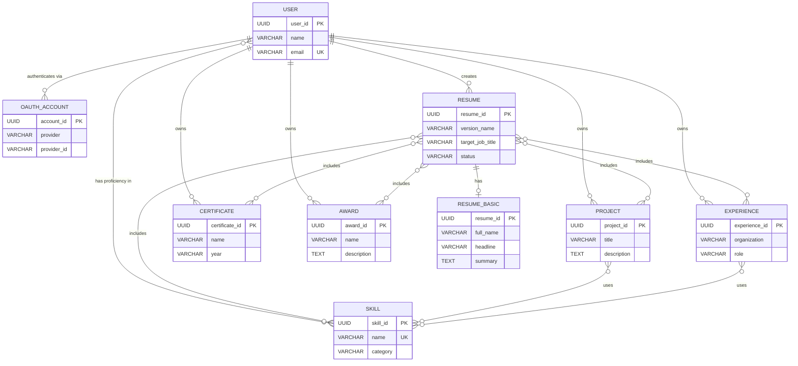
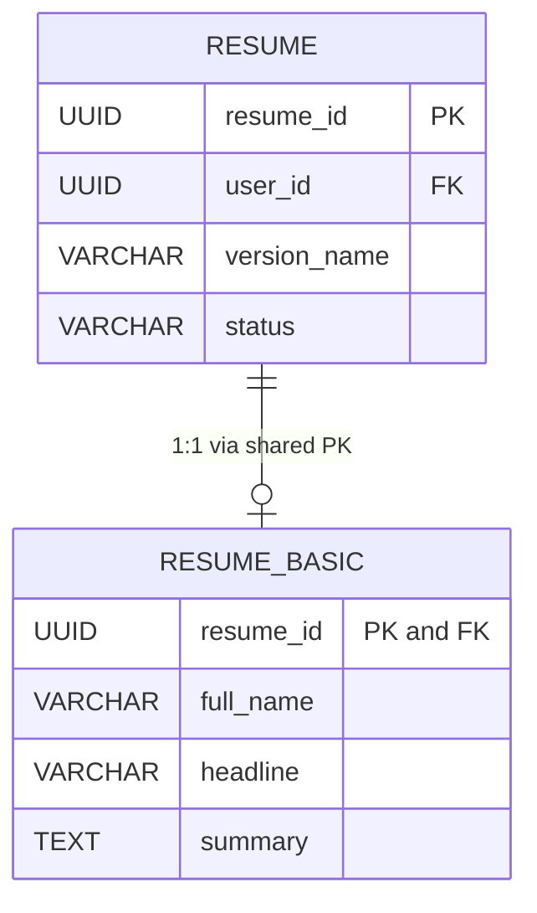
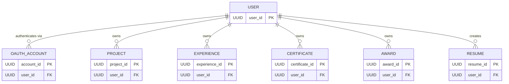

# Database Design Document (ฉบับภาษาไทย)

> **Project:** Universal Academic Portfolio System (UAPS)  
> **Module:** Resume Vault & Resume Builder  
> **Database Engine:** PostgreSQL 17  
> **ORM:** Prisma  
> **Author:** Anothai Vichapaiboon  
> **Document Version:** 1.0 (TH)  
> **Last Updated:** 2026-06-14

---

## บทที่ 1 — ภาพรวมโครงการและการวิเคราะห์ความต้องการ

### 1.1 วัตถุประสงค์ของโครงการ

Universal Academic Portfolio System (UAPS) เป็น web application ที่ให้ผู้ใช้จัดเก็บข้อมูล portfolio ของตนเอง — ไม่ว่าจะเป็น skill, project, work experience, certificate หรือ award — ไว้ในพื้นที่ส่วนตัวที่เรียกว่า **vault** จากนั้นผู้ใช้สามารถสร้าง resume หลายฉบับจาก vault โดยเลือกข้อมูลที่ต้องการใส่ในแต่ละ resume ให้ตรงกับตำแหน่งงานหรือบริษัทที่สมัคร

ระบบนี้แก้ปัญหาที่พบบ่อย: คนส่วนใหญ่มี resume แค่ฉบับเดียวแล้ว copy-paste เนื้อหาเองเวลาสมัครงานต่างตำแหน่ง UAPS แก้ปัญหานี้ด้วยการแยก **การจัดเก็บข้อมูล** (vault) ออกจาก **การนำเสนอข้อมูล** (resume) ทำให้ผู้ใช้มีแหล่งข้อมูลเดียวที่เป็นความจริง (single source of truth) แล้วสร้าง resume ที่ปรับแต่งได้หลายฉบับ

### 1.2 ผู้ใช้งานหลัก

ระบบมี user role เพียงหนึ่งเดียว:

- **Portfolio Owner** — บุคคลที่ลงทะเบียนผ่าน OAuth (GitHub, Google เป็นต้น) จัดการข้อมูลใน vault และประกอบ resume

ระบบบังคับใช้ **multi-user data isolation**: ผู้ใช้แต่ละคนสามารถดูและแก้ไขได้เฉพาะข้อมูลของตนเองเท่านั้น ไม่มี admin role หรือการเข้าถึงข้อมูลข้ามผู้ใช้ในขอบเขตปัจจุบัน

### 1.3 Feature หลักและความต้องการด้านข้อมูล

แต่ละ feature ถูก trace ไปยัง business rule และผลกระทบต่อข้อมูล

---

**Feature 1: การลงทะเบียนและ Authentication**

ผู้ใช้ลงทะเบียนโดย sign in ผ่าน OAuth provider ภายนอก เช่น GitHub หรือ Google ระบบจะสร้างหรือเชื่อมต่อ user account ตาม email address

> **Business Rule:** user account หนึ่งบัญชีถูกระบุด้วย email address ที่ไม่ซ้ำกัน ผู้ใช้คนเดียวสามารถเชื่อม OAuth provider หลายตัว (เช่น ทั้ง GitHub และ Google) เข้ากับบัญชีเดียวกันได้
>
> **ผลกระทบต่อข้อมูล:** ต้องมี 2 entity — **User** แทนบัญชีผู้ใช้ และ **OAuthAccount** เก็บข้อมูล provider แต่ละตัวที่เชื่อมอยู่ ความสัมพันธ์เป็น 1:N (user หนึ่งคนมีได้หลาย OAuth account)

---

**Feature 2: Skills Vault**

ผู้ใช้เก็บรายการ skill ส่วนตัว (เช่น TypeScript, PostgreSQL, Docker) พร้อมระดับความเชี่ยวชาญที่ประเมินเอง โดยเลือก skill จาก catalog ที่ใช้ร่วมกันทั้งระบบ

> **Business Rule:** Skill ถูกใช้ร่วมกันข้าม user ทุกคน — ถ้า "TypeScript" มีอยู่ใน catalog ผู้ใช้ทุกคนจะเลือก record เดียวกัน แต่ละคนบันทึกระดับความเชี่ยวชาญของตนเองต่อ skill แต่ละตัว
>
> **ผลกระทบต่อข้อมูล:** มี 2 entity — **Skill** (shared catalog) และ relationship ระหว่าง User กับ Skill เนื่องจาก user หนึ่งคนมีได้หลาย skill และ skill หนึ่งตัวอยู่ได้กับหลาย user จึงเป็น M:N relationship โดยระดับความเชี่ยวชาญเป็น attribute ของ relationship ไม่ใช่ของ entity ใด entity หนึ่ง

---

**Feature 3: Projects Vault**

ผู้ใช้เพิ่ม portfolio project พร้อม title, description, repository URL และ skill ที่เกี่ยวข้อง

> **Business Rule:** แต่ละ project เป็นของ user คนเดียว สามารถ tag skill จาก shared catalog ได้ตั้งแต่ศูนย์ตัวขึ้นไป
>
> **ผลกระทบต่อข้อมูล:** **Project** entity เป็นของ User (1:N) บวกกับ M:N relationship ระหว่าง Project กับ Skill สำหรับ skill tagging

---

**Feature 4: Experiences Vault**

ผู้ใช้บันทึก work experience รวมถึงชื่อองค์กร ตำแหน่ง วันที่ รายละเอียด และผลงาน โดยแต่ละ experience สามารถ tag skill ที่เกี่ยวข้องได้

> **Business Rule:** แต่ละ experience เป็นของ user คนเดียว start date และ end date เป็น optional เพื่อรองรับตำแหน่งที่ยังทำงานอยู่
>
> **ผลกระทบต่อข้อมูล:** **Experience** entity เป็นของ User (1:N) บวกกับ M:N relationship ระหว่าง Experience กับ Skill

---

**Feature 5: Certificates Vault**

ผู้ใช้บันทึก certificate พร้อมชื่อและปีที่ได้รับ

> **Business Rule:** แต่ละ certificate เป็นของ user คนเดียว
>
> **ผลกระทบต่อข้อมูล:** **Certificate** entity เป็นของ User (1:N)

---

**Feature 6: Awards Vault**

ผู้ใช้บันทึก award และเกียรติยศ พร้อมชื่อและรายละเอียด

> **Business Rule:** แต่ละ award เป็นของ user คนเดียว ทุก award ต้องมี description
>
> **ผลกระทบต่อข้อมูล:** **Award** entity เป็นของ User (1:N)

---

**Feature 7: การประกอบ Resume**

ผู้ใช้สร้าง resume ได้หลายฉบับ แต่ละฉบับกำหนดเป้าหมายไปที่ตำแหน่งงานและบริษัทที่เจาะจง โดยเลือกว่าจะนำ project, skill, experience, certificate และ award ชิ้นไหนจาก vault ใส่ใน resume แต่ละฉบับ

> **Business Rule:** user หนึ่งคนสร้าง resume ได้หลายฉบับ แต่ละฉบับประกอบขึ้นจากการ **เลือก** vault item ที่มีอยู่ — ข้อมูลไม่ถูก duplicate project เดียวกันสามารถปรากฏในหลาย resume และ resume เดียวสามารถรวม project ได้หลายชิ้น
>
> **ผลกระทบต่อข้อมูล:** **Resume** entity เป็นของ User (1:N) ต้องมี M:N relationship 5 ชุดเพื่อเชื่อม Resume กับ vault entity แต่ละประเภท: Resume–Project, Resume–Skill, Resume–Experience, Resume–Certificate, Resume–Award

---

**Feature 8: ข้อมูลพื้นฐานของ Resume**

แต่ละ resume มีส่วนหัวที่ประกอบด้วย full name, headline, ข้อมูลติดต่อ และ profile summary ข้อมูลเหล่านี้สามารถแตกต่างกันระหว่าง resume แต่ละฉบับ (เช่น เบอร์โทรหรือ summary ที่ต่างกันสำหรับการสมัครงานต่างตำแหน่ง)

> **Business Rule:** แต่ละ resume มีชุดข้อมูลพื้นฐานได้มากที่สุดหนึ่งชุด resume อาจยังไม่มีข้อมูลพื้นฐานก็ได้ (ในสถานะ draft)
>
> **ผลกระทบต่อข้อมูล:** **ResumeBasic** entity มี 1:1 relationship กับ Resume โดย ResumeBasic ไม่สามารถดำรงอยู่ได้ด้วยตัวเอง — ต้องพึ่งพา Resume ที่เจาะจงสำหรับการระบุตัวตน

---

### 1.4 สรุปความต้องการ

| ID  | ความต้องการ                                                | Entity ที่เกี่ยวข้อง                                         | Relationship         |
| --- | --------------------------------------------------------- | ------------------------------------------------------------ | -------------------- |
| R1  | การลงทะเบียนผู้ใช้ผ่าน OAuth                               | User, OAuthAccount                                           | 1:N                  |
| R2  | จัดการ skill ส่วนตัวพร้อมระดับความเชี่ยวชาญ                   | User, Skill                                                  | M:N (with attribute) |
| R3  | จัดการ portfolio project พร้อม tag skill                    | User, Project, Skill                                         | 1:N + M:N            |
| R4  | จัดการ work experience พร้อม tag skill                     | User, Experience, Skill                                      | 1:N + M:N            |
| R5  | จัดการ certificate                                        | User, Certificate                                            | 1:N                  |
| R6  | จัดการ award                                              | User, Award                                                  | 1:N                  |
| R7  | ประกอบ resume จาก vault item                               | User, Resume, Project, Skill, Experience, Certificate, Award | 1:N + five M:N       |
| R8  | ข้อมูลส่วนหัว/ข้อมูลติดต่อของ resume                        | Resume, ResumeBasic                                          | 1:1                  |

---

### 1.5 ข้อตั้งต้น (Assumptions)

ข้อตั้งต้นต่อไปนี้ถือเป็นจริงสำหรับการออกแบบ database นี้:

1. **ผู้ใช้หนึ่งคน = email หนึ่งอัน** user account ถูกระบุตัวตนด้วย email address ที่ไม่ซ้ำกัน สองคนที่ต่างกันไม่สามารถใช้ email เดียวกันได้
2. **Email เป็นจุดยึดตัวตนข้าม OAuth provider** ถ้าผู้ใช้ login ด้วย GitHub (email: a@b.com) แล้วมา login ด้วย Google (email เดียวกัน) provider ทั้งสองจะเชื่อมกับ User record เดียวกัน
3. **ชื่อ Skill ไม่ซ้ำกันทั้งระบบ** มี "TypeScript" เพียงตัวเดียวในระบบ Skill catalog ใช้ร่วมกันทุก user
4. **Vault item แต่ละชิ้นเป็นของ user คนเดียว** project, experience, certificate หรือ award ไม่สามารถแชร์ระหว่าง user ได้
5. **Resume อ้างอิงข้อมูลจาก vault ไม่ใช่ copy** การเปลี่ยน title ของ project ใน vault จะมีผลกับทุก resume ที่รวม project นั้นอยู่
6. **Primary key ทั้งหมดเป็น UUID ที่ server สร้างขึ้น** application ไม่รับ client-generated ID
7. **Timestamp เก็บเป็น UTC** การแปลง timezone จัดการที่ frontend

### 1.6 ข้อจำกัด (Limitations)

Feature ต่อไปนี้ **ไม่ได้** รองรับในการออกแบบ database ปัจจุบันโดยตั้งใจ:

1. **ไม่มีการแชร์ resume ระหว่าง user** resume เป็นของ user คนเดียว ไม่มีกลไก collaborative editing หรือ sharing
2. **ไม่มี soft delete** record ที่ถูกลบจะถูกลบออกจาก database อย่างถาวร ไม่มี column `deleted_at` หรือ trash/archive
3. **ไม่มี versioning history** เมื่อผู้ใช้แก้ไข project หรือ experience ข้อมูลเก่าจะถูกเขียนทับ ไม่มี change log หรือ revision history
4. **ไม่มีการเก็บ file/image** database เก็บ URL (เช่น `avatar_url`, `repo_url`) แต่ไม่เก็บ binary file การ host file อยู่ภายนอก
5. **ไม่มี role-based access control** มี user role เพียง role เดียว (Portfolio Owner) ไม่มี admin, reviewer หรือ viewer role
6. **ไม่มี skill hierarchy** Skill เป็นโครงสร้างแบบแบน — ไม่มี parent-child relationship (เช่น "JavaScript" ไม่ใช่ parent ของ "TypeScript")

---

## บทที่ 2 — Conceptual Database Design

บทนี้ระบุว่าระบบต้องเก็บข้อมูลอะไรบ้าง จัดหมวดหมู่ตามประเภทข้อมูล ก่อนที่จะพิจารณารายละเอียดการ implement เช่น data type หรือโครงสร้าง table

### 2.1 Master Data

Master data แทนข้อมูลอ้างอิงที่ใช้ร่วมกันข้าม user และเปลี่ยนแปลงไม่บ่อย

#### Skill

**UI ที่เกี่ยวข้อง:** เมื่อผู้ใช้เพิ่ม skill เข้า vault, tag project ด้วย skill หรือ tag experience ด้วย skill พวกเขาจะเลือกจาก skill catalog ที่ใช้ร่วมกันทั้งระบบ (เช่น dropdown หรือ search component)

**จุดประสงค์ทางธุรกิจ:** Skill entity ดำรงอยู่เป็น shared catalog เพื่อให้ชื่อ skill สม่ำเสมอข้าม user ทุกคน ถ้าไม่มีสิ่งนี้ user คนหนึ่งอาจพิมพ์ "TypeScript" ขณะที่อีกคนพิมพ์ "typescript" หรือ "TS" ทำให้การค้นหาหรือรวมข้อมูลเป็นไปไม่ได้

**Entity:** Skill

**Attribute:**
- skill_id — ตัวระบุเฉพาะ
- name — ชื่อแสดงผลของ skill (ไม่ซ้ำกันทั้งระบบ)
- category — การจัดหมวดหมู่ เช่น "Programming Language", "Framework", "Database"

**Relationship:**
- M:N กับ User (ผ่าน user_skills พร้อมระดับความเชี่ยวชาญ)
- M:N กับ Project (ผ่าน project_skills)
- M:N กับ Experience (ผ่าน experience_skills)
- M:N กับ Resume (ผ่าน resume_skills)

---

### 2.2 Operational / Transaction Data

Operational data ถูกสร้าง แก้ไข และลบผ่านการกระทำของผู้ใช้

#### User

**UI ที่เกี่ยวข้อง:** User ถูกสร้างอัตโนมัติเมื่อ login ผ่าน OAuth ครั้งแรก ชื่อและรูปของผู้ใช้แสดงใน dashboard header

**จุดประสงค์ทางธุรกิจ:** แทนเจ้าของบัญชี ข้อมูลทุกอย่างใน vault และ resume ทั้งหมดถูก scope ไว้กับ user คนเดียว email address ทำหน้าที่เป็นจุดยึดตัวตนข้าม provider — ถ้าผู้ใช้ login ด้วย GitHub แล้วมา login ด้วย Google โดยใช้ email เดียวกัน provider ทั้งสองจะเชื่อมกับ User record เดียวกัน

**Entity:** User

**Attribute:**
- user_id — ตัวระบุเฉพาะ
- name — ชื่อแสดงผล
- email — ตัวตนสำหรับ login ที่ไม่ซ้ำกัน
- github_url, github_id, github_login — field เฉพาะ GitHub ที่เป็น legacy (เก็บไว้เพื่อ backward compatibility)
- avatar_url — URL รูปโปรไฟล์
- created_at, updated_at — timestamp สำหรับ audit

**Relationship:**
- 1:N กับ OAuthAccount, Project, Experience, Certificate, Award, Resume
- M:N กับ Skill

---

#### OAuthAccount

**UI ที่เกี่ยวข้อง:** หน้า login แสดงปุ่มสำหรับ OAuth provider แต่ละตัว (GitHub, Google, Discord, Line, Facebook, Instagram) provider ที่เชื่อมแล้วแสดงในหน้า profile ของผู้ใช้

**จุดประสงค์ทางธุรกิจ:** เก็บข้อมูล credential สำหรับ OAuth provider ภายนอกแต่ละตัวที่เชื่อมกับ user account ระบบออกแบบให้เป็น provider-agnostic — การเพิ่ม OAuth provider ใหม่ไม่ต้องเปลี่ยน schema เพียงเพิ่ม row ใหม่ที่มีชื่อ provider ต่างกัน

**Entity:** OAuthAccount

**Attribute:**
- account_id — ตัวระบุเฉพาะ
- user_id — บัญชี user ที่ account นี้สังกัด
- provider — ชื่อ provider (เช่น "github", "google")
- provider_id — ID เฉพาะของผู้ใช้ภายใน provider นั้น
- provider_login — username บน provider นั้น
- profile_url — link ไปยัง profile ของผู้ใช้บน provider นั้น
- avatar_url — URL รูปโปรไฟล์จาก provider นั้น
- created_at, updated_at — timestamp สำหรับ audit

**Relationship:**
- N:1 กับ User (OAuth account หลายตัวสังกัด user คนเดียว)

---

#### Project

**UI ที่เกี่ยวข้อง:** หน้า vault ที่ผู้ใช้สร้างและแก้ไข portfolio project แต่ละ project card แสดง title, description, skill ที่ใช้ และ repository link

**จุดประสงค์ทางธุรกิจ:** แทนผลงานที่ผู้ใช้ต้องการแสดง Project สามารถ tag skill เพื่อระบุเทคโนโลยีที่ใช้ และสามารถเลือกใส่ resume ฉบับใดก็ได้

**Entity:** Project

**Attribute:**
- project_id — ตัวระบุเฉพาะ
- user_id — เจ้าของ
- title — ชื่อ project
- description — project ทำอะไร
- repo_url — link ไปยัง source code
- is_active — project ยังถูก maintain อยู่หรือไม่
- status — สถานะวงจรชีวิตของ project (เช่น "Completed")
- created_at, updated_at

**Relationship:**
- N:1 กับ User
- M:N กับ Skill (skill tagging)
- M:N กับ Resume (resume composition)

---

#### Experience

**UI ที่เกี่ยวข้อง:** หน้า vault ที่ผู้ใช้บันทึก work experience แต่ละรายการแสดงองค์กร ตำแหน่ง ช่วงเวลา และ skill ที่ใช้

**จุดประสงค์ทางธุรกิจ:** แทนตำแหน่งงานหรืองานอาสา Experience สามารถ tag skill ที่เกี่ยวข้องและถูกรวมเข้า resume ได้

**Entity:** Experience

**Attribute:**
- experience_id — ตัวระบุเฉพาะ
- user_id — เจ้าของ
- organization — ชื่อบริษัทหรือสถาบัน
- role — ตำแหน่งงาน
- description — หน้าที่รับผิดชอบ
- achievement — ผลงานสำคัญ
- start_date — วันที่เริ่มตำแหน่ง (optional สำหรับตำแหน่งที่ยังทำอยู่)
- end_date — วันที่สิ้นสุด (optional)
- created_at, updated_at

**Relationship:**
- N:1 กับ User
- M:N กับ Skill
- M:N กับ Resume

---

#### Certificate

**UI ที่เกี่ยวข้อง:** หน้า vault ที่ผู้ใช้เพิ่ม certification

**จุดประสงค์ทางธุรกิจ:** บันทึก certificate วิชาชีพที่ผู้ใช้ได้รับ

**Entity:** Certificate

**Attribute:**
- certificate_id — ตัวระบุเฉพาะ
- user_id — เจ้าของ
- name — ชื่อ certificate
- year — ปีที่สำเร็จ (เก็บเป็น text เช่น "2024")
- created_at, updated_at

**Relationship:**
- N:1 กับ User
- M:N กับ Resume

---

#### Award

**UI ที่เกี่ยวข้อง:** หน้า vault ที่ผู้ใช้เพิ่ม award และเกียรติยศ

**จุดประสงค์ทางธุรกิจ:** บันทึก award หรือการยกย่อง ต่างจาก Certificate ตรงที่ทุก Award ต้องมี description อธิบายผลงาน

**Entity:** Award

**Attribute:**
- award_id — ตัวระบุเฉพาะ
- user_id — เจ้าของ
- name — ชื่อ award
- description — สิ่งที่ได้รับการยกย่อง (ต้องระบุ)
- created_at, updated_at

**Relationship:**
- N:1 กับ User
- M:N กับ Resume

---

#### Resume

**UI ที่เกี่ยวข้อง:** หน้า resume builder ที่ผู้ใช้สร้างและจัดการ resume แต่ละฉบับ แต่ละ resume แสดง version name, target job และให้เลือก vault item ได้

**จุดประสงค์ทางธุรกิจ:** แทน resume ฉบับที่ปรับแต่งแล้ว ผู้ใช้สามารถสร้าง resume หลายฉบับสำหรับตำแหน่งงานต่าง ๆ แต่ละฉบับประกอบขึ้นจากการเลือก item จาก vault — ไม่ duplicate ข้อมูลจาก vault แต่อ้างอิงไปที่ข้อมูลเดิม

**Entity:** Resume

**Attribute:**
- resume_id — ตัวระบุเฉพาะ
- user_id — เจ้าของ
- version_name — ชื่อที่ผู้ใช้ตั้ง (เช่น "Frontend Dev @ Google v2")
- target_job_title — ตำแหน่งที่ resume นี้เป้าหมาย
- target_company — บริษัทที่ resume นี้เป้าหมาย
- visibility — การควบคุมการเข้าถึง ("private" หรือ "public")
- profile_summary — ประโยคแนะนำตัวสั้น ๆ
- location, phone, linkedin_url, portfolio_url — ข้อมูลติดต่อ
- is_active — เป็น resume หลักที่ใช้อยู่หรือไม่
- status — สถานะวงจรชีวิต ("Draft", "Active", "Archived")
- created_at, updated_at

**Relationship:**
- N:1 กับ User
- 1:1 กับ ResumeBasic
- M:N กับ Project, Skill, Experience, Certificate, Award

---

#### ResumeBasic

**UI ที่เกี่ยวข้อง:** ส่วนหัวของ resume builder — name, headline, email, phone, summary

**จุดประสงค์ทางธุรกิจ:** เก็บข้อมูลติดต่อและโปรไฟล์ระดับการนำเสนอเฉพาะ resume แต่ละฉบับ ถูกแยกออกจาก Resume เพราะคน ๆ เดียวอาจต้องการแสดง headline, summary หรือข้อมูลติดต่อที่ต่างกันสำหรับการสมัครงานต่างตำแหน่ง ResumeBasic ไม่สามารถดำรงอยู่ได้โดยไม่มี Resume ต้นทาง — มันพึ่งพา Resume สำหรับการระบุตัวตน

**Entity:** ResumeBasic

**Attribute:**
- resume_id — ตัวระบุเฉพาะ (ใช้ ID เดียวกับ Resume ต้นทาง)
- full_name — ชื่อแสดงผลบน resume
- headline — ตำแหน่งวิชาชีพหรือ tagline
- email, phone, location — ข้อมูลติดต่อ
- linkedin_url, portfolio_url, github_url — social link
- summary — ประโยคแนะนำตัว
- created_at, updated_at

**Relationship:**
- 1:1 กับ Resume (total participation ฝั่ง ResumeBasic)

---

### 2.3 Conceptual ER Diagram

diagram ต่อไปนี้แสดง entity ทั้งหมด, relationship และ cardinality ในระดับ conceptual ไม่มีรายละเอียดการ implement (data type, foreign key)



---

## บทที่ 3 — Logical Database Design

บทนี้แปลง conceptual ER model เป็นโครงสร้าง relational แต่ละขั้นตอนการ mapping อธิบายว่าใช้การแปลงอะไรและทำไม

### 3.1 การ Map Strong (Regular) Entity

Strong entity คือ entity ที่มี primary key เป็นของตัวเองและไม่พึ่งพา entity อื่นในการดำรงอยู่ strong entity แต่ละตัว map ไปเป็น relation (table) ได้โดยตรง

---

**Entity: User**

User entity แทนเจ้าของบัญชีที่ลงทะเบียนแล้ว มี natural candidate key (email) แต่ใช้ surrogate UUID เป็น primary key เพื่อความสม่ำเสมอและหลีกเลี่ยงการเปิดเผยข้อมูลที่ sensitive ใน URL

> **Transformation:** User entity → `users` relation
>
> **Result:** `users(user_id, name, email, github_url, github_id, github_login, avatar_url, created_at, updated_at)`

---

**Entity: Skill**

Skill entity แทนรายการใน shared skill catalog มี natural candidate key (name) และ surrogate primary key (skill_id)

> **Transformation:** Skill entity → `skills` relation
>
> **Result:** `skills(skill_id, name, category)`

---

**Entity: OAuthAccount**

OAuthAccount entity เก็บ authentication provider ภายนอกที่เชื่อมแล้ว การรวมกันของ (provider, provider_id) เป็น natural key แต่ใช้ surrogate UUID เป็น primary key เพื่อความง่าย

> **Transformation:** OAuthAccount entity → `oauth_accounts` relation
>
> **Result:** `oauth_accounts(account_id, user_id, provider, provider_id, provider_login, profile_url, avatar_url, created_at, updated_at)`

---

**Entity: Project**

> **Transformation:** Project entity → `projects` relation
>
> **Result:** `projects(project_id, user_id, title, description, repo_url, is_active, status, created_at, updated_at)`

---

**Entity: Experience**

> **Transformation:** Experience entity → `experiences` relation
>
> **Result:** `experiences(experience_id, user_id, organization, role, description, achievement, start_date, end_date, created_at, updated_at)`

---

**Entity: Certificate**

> **Transformation:** Certificate entity → `certificates` relation
>
> **Result:** `certificates(certificate_id, user_id, name, year, created_at, updated_at)`

---

**Entity: Award**

> **Transformation:** Award entity → `awards` relation
>
> **Result:** `awards(award_id, user_id, name, description, created_at, updated_at)`

---

**Entity: Resume**

> **Transformation:** Resume entity → `resumes` relation
>
> **Result:** `resumes(resume_id, user_id, version_name, target_job_title, target_company, visibility, profile_summary, location, phone, linkedin_url, portfolio_url, is_active, status, created_at, updated_at)`

---

### 3.2 การ Map Weak Entity

ในทฤษฎี relational database **weak entity** คือ entity type ที่ไม่สามารถระบุตัวตนได้ด้วย attribute ของตัวเองเพียงอย่างเดียว ต้องพึ่งพา **identifying relationship** (เรียกว่า **owner** หรือ **parent** entity) เพื่อสร้าง primary key ของมัน weak entity มีคุณสมบัติเชิงนิยาม 2 ข้อ:

1. **Existence dependency** — weak entity ไม่สามารถดำรงอยู่ใน database ได้หากไม่มี row ของ owner entity ที่ตรงกัน
2. **Identification dependency** — primary key ของ weak entity รวม (หรือเท่ากับ) primary key ของ owner entity

เทคนิค mapping มาตรฐานคือใช้ primary key ของ owner entity เป็น primary key ของ weak entity (หรือเป็นส่วนหนึ่ง) ทำหน้าที่เป็นทั้ง PK และ foreign key พร้อม `ON DELETE CASCADE` พร้อมกัน

**Entity: ResumeBasic (Weak Entity)**

ResumeBasic เข้าเกณฑ์ weak entity ทั้งสองข้อ:

- **Existence dependency:** ResumeBasic row ไม่สามารถดำรงอยู่ได้หากไม่มี Resume row ที่ตรงกัน ถ้า Resume ถูกลบ ResumeBasic ที่เกี่ยวข้องจะถูกลบอัตโนมัติผ่าน CASCADE
- **Identification dependency:** ResumeBasic ไม่มี primary key เป็นของตัวเอง ตัวระบุเดียวของมัน (`resume_id`) ยืมมาจาก owner entity (Resume) column นี้ทำหน้าที่เป็นทั้ง primary key ของ `resume_basics` และ foreign key ที่อ้างถึง `resumes(resume_id)` พร้อมกัน

เทคนิค shared-PK นี้ยังบังคับใช้ **1:1 cardinality constraint** ที่ระดับ database ได้ด้วย: เนื่องจาก `resume_id` เป็น primary key ของ `resume_basics` จึงมีได้มากสุดหนึ่ง row ต่อ resume — ไม่ต้องมี UNIQUE constraint เพิ่มเติมหรือ application logic ใด ๆ

> **Owner entity:** Resume (strong entity)
>
> **Identifying relationship:** ResumeBasic ถูกระบุตัวตนจาก Resume ที่มันสังกัด
>
> **Transformation:** ResumeBasic weak entity → `resume_basics` relation
>
> **Result:** `resume_basics(resume_id, full_name, headline, email, phone, location, linkedin_url, portfolio_url, github_url, summary, created_at, updated_at)` โดยที่ `resume_id` เป็นทั้ง PK และ FK ที่อ้างถึง `resumes(resume_id)` พร้อม ON DELETE CASCADE

---

### 3.3 การ Map Multivalued Attribute

ใน ER modeling **multivalued attribute** คือ attribute ที่สามารถมีค่าหลายค่าสำหรับ entity instance เดียว (เช่น คนหนึ่งมีเบอร์โทรหลายเบอร์) เทคนิค mapping มาตรฐานคือสร้าง relation แยกที่ primary key ประกอบด้วย PK ของ owner entity บวกกับค่าของ attribute

**ไม่มีในโครงการนี้**

ทุก attribute ในทุก entity เป็น **single-valued** (atomic) แนวคิดที่อาจดูเหมือนเป็น multivalued — เช่น ผู้ใช้มีหลาย skill — ถูก model เป็น **entity แยกที่มี M:N relationship** (User ↔ Skill) ไม่ใช่เป็น multivalued attribute ของ User entity วิธีนี้เหมาะกว่าเมื่อข้อมูลที่เป็น "multi-valued" มีตัวตนและ attribute เป็นของตัวเอง (เช่น Skill แต่ละตัวมี `name` และ `category`)

ในทำนองเดียวกัน ผู้ใช้ที่มี project, experience, certificate หรือ award หลายรายการถูก model ผ่าน 1:N relationship ไปยัง entity อิสระ ไม่ใช่เป็น multivalued attribute ความแตกต่างนี้สำคัญ: multivalued attribute จะสร้าง dependent table ที่ไม่มีตัวตนเป็นของตัวเอง แต่ entity ของเรา (Project, Experience ฯลฯ) เป็น strong entity ที่มี surrogate primary key เป็นของตัวเอง

---

### 3.4 การ Map 1:1 Relationship

ในการออกแบบ relational **1:1 (one-to-one) relationship** เชื่อม entity type สองตัวเข้าด้วยกัน โดย instance ของ entity หนึ่งเชื่อมกับ instance อีกตัวได้มากที่สุดหนึ่งเดียว การตัดสินใจสำคัญคือ **จะวาง foreign key ไว้ที่ไหน** ซึ่งขึ้นอยู่กับ **participation constraint** ของแต่ละฝั่ง

**Resume ↔ ResumeBasic (1:1)**

ความสัมพันธ์ระหว่าง Resume กับ ResumeBasic เป็น one-to-one: แต่ละ resume มีข้อมูลพื้นฐานได้มากที่สุดหนึ่งชุด และข้อมูลพื้นฐานแต่ละชุดสังกัด resume เพียงฉบับเดียว

**Participation constraint:**
- **ฝั่ง Resume — partial participation:** Resume สามารถดำรงอยู่ได้โดยไม่มี ResumeBasic (เช่น draft ที่เพิ่งสร้าง) ไม่ใช่ทุก Resume entity ที่เข้าร่วมใน relationship นี้
- **ฝั่ง ResumeBasic — total participation:** ResumeBasic ไม่สามารถดำรงอยู่ได้โดยไม่มี Resume ทุก ResumeBasic entity ต้องเข้าร่วมใน relationship นี้

ตาม mapping rule มาตรฐานสำหรับ 1:1 relationship: **foreign key ถูกวางไว้ที่ฝั่งที่มี total participation** (ResumeBasic) เนื่องจาก ResumeBasic เป็น weak entity ด้วย (§3.2) foreign key (`resume_id`) จึงทำหน้าที่เป็น primary key ด้วย — นี่คือเทคนิคมาตรฐานสำหรับการบังคับ 1:1 cardinality constraint ที่ระดับ schema โดยไม่ต้องพึ่ง application logic หรือ UNIQUE constraint เพิ่มเติม

> **Result:** column `resume_id` ใน `resume_basics` ทำหน้าที่เป็น:
> - primary key ของ `resume_basics`
> - foreign key ที่อ้างถึง `resumes(resume_id)`

diagram ต่อไปนี้แสดงว่า shared primary key บังคับ 1:1 constraint อย่างไร:



> **อ่าน diagram นี้:** `resume_id` ใน `resume_basics` เป็นทั้ง primary key และ foreign key ไปยัง `resumes` สัญลักษณ์ `||--o|` บ่งบอกว่า Resume มี partial participation (ดำรงอยู่ได้โดยไม่มี ResumeBasic) ขณะที่ ResumeBasic มี total participation (ดำรงอยู่เองไม่ได้)

---

### 3.5 การ Map 1:N Relationship

1:N relationship ถูก map โดยวาง foreign key ใน relation ฝั่ง "many" ชี้ไปที่ primary key ของ relation ฝั่ง "one"

User entity เป็นศูนย์กลางของความเป็นเจ้าของ ข้อมูลใน vault และ resume ทั้งหมดสังกัด user เพียงคนเดียว diagram ต่อไปนี้แสดงโครงสร้าง 1:N ownership ทั้งหมด:



> **ข้อสังเกตสำคัญ:** child table ทุกตัวมี `user_id` foreign key (NOT NULL) ชี้ไปที่ `users.user_id` พร้อม ON DELETE CASCADE นี่คือรากฐานของ multi-user data isolation — ทุก query จะ filter ด้วย `user_id`

---

**User → Project (1:N)**

> **Business Rule:** user หนึ่งคนสร้าง project ได้หลายอัน แต่ละ project เป็นของ user เพียงคนเดียว
>
> **Transformation:** วาง `user_id` เป็น foreign key ใน `projects` relation
>
> **Result:** `projects.user_id` → `users.user_id` (ON DELETE CASCADE)
>
> **เหตุผล:** ถ้า project สามารถดำรงอยู่ได้โดยไม่มีเจ้าของ FK ที่ nullable จะเหมาะสม แต่เนื่องจากทุก project ต้องสังกัด user FK จึงเป็น NOT NULL CASCADE delete รับประกันว่าการลบ user account จะลบ project ทั้งหมดด้วย

---

**User → Experience (1:N)**

> **Business Rule:** user หนึ่งคนบันทึก work experience ได้หลายรายการ
>
> **Result:** `experiences.user_id` → `users.user_id` (NOT NULL, ON DELETE CASCADE)

---

**User → Certificate (1:N)**

> **Business Rule:** user หนึ่งคนมี certificate ได้หลายใบ
>
> **Result:** `certificates.user_id` → `users.user_id` (NOT NULL, ON DELETE CASCADE)

---

**User → Award (1:N)**

> **Business Rule:** user หนึ่งคนได้รับ award ได้หลายรางวัล
>
> **Result:** `awards.user_id` → `users.user_id` (NOT NULL, ON DELETE CASCADE)

---

**User → Resume (1:N)**

> **Business Rule:** user หนึ่งคนสร้าง resume ได้หลายฉบับ แต่ละฉบับเป้าหมายตำแหน่งต่างกัน
>
> **Result:** `resumes.user_id` → `users.user_id` (NOT NULL, ON DELETE CASCADE)

---

**User → OAuthAccount (1:N)**

> **Business Rule:** user หนึ่งคนเชื่อม OAuth provider ได้หลายตัว (เช่น GitHub กับ Google พร้อมกัน)
>
> **Result:** `oauth_accounts.user_id` → `users.user_id` (NOT NULL, ON DELETE CASCADE)

---

### 3.6 การ Map M:N Relationship

M:N relationship ไม่สามารถแทนได้โดยตรงใน relational model เนื่องจาก foreign key column เดียวไม่สามารถอ้างถึงหลาย row ได้ วิธีแก้มาตรฐานคือสร้าง **junction relation** (เรียกอีกอย่างว่า associative table หรือ bridge table) ที่ primary key เป็น composite ของ foreign key ทั้งสอง

ระบบมี M:N relationship 2 ประเภท:

1. **Skill tagging** — User, Project และ Experience แต่ละตัวมี M:N กับ Skill
2. **Resume composition** — Resume มี M:N กับ vault entity 5 ตัว

diagram ต่อไปนี้แสดงว่า conceptual M:N relationship ถูกแยกเป็น junction table อย่างไร แต่ละ junction table มี foreign key สองตัวเป็น composite primary key:

```mermaid
erDiagram
    %% Skill tagging M:N relationships
    USER ||--o{ user_skills : "has"
    SKILL ||--o{ user_skills : "tagged in"
    user_skills {
        UUID user_id PK,FK
        UUID skill_id PK,FK
        VARCHAR proficiency_level
    }

    PROJECT ||--o{ project_skills : "uses"
    SKILL ||--o{ project_skills : "tagged in"
    project_skills {
        UUID project_id PK,FK
        UUID skill_id PK,FK
    }

    EXPERIENCE ||--o{ experience_skills : "uses"
    SKILL ||--o{ experience_skills : "tagged in"
    experience_skills {
        UUID experience_id PK,FK
        UUID skill_id PK,FK
    }

    %% Resume composition M:N relationships
    RESUME ||--o{ resume_projects : "includes"
    PROJECT ||--o{ resume_projects : "selected in"
    resume_projects {
        UUID resume_id PK,FK
        UUID project_id PK,FK
    }

    RESUME ||--o{ resume_skills : "includes"
    SKILL ||--o{ resume_skills : "selected in"
    resume_skills {
        UUID resume_id PK,FK
        UUID skill_id PK,FK
    }

    RESUME ||--o{ resume_experiences : "includes"
    EXPERIENCE ||--o{ resume_experiences : "selected in"
    resume_experiences {
        UUID resume_id PK,FK
        UUID experience_id PK,FK
    }

    RESUME ||--o{ resume_certificates : "includes"
    CERTIFICATE ||--o{ resume_certificates : "selected in"
    resume_certificates {
        UUID resume_id PK,FK
        UUID certificate_id PK,FK
    }

    RESUME ||--o{ resume_awards : "includes"
    AWARD ||--o{ resume_awards : "selected in"
    resume_awards {
        UUID resume_id PK,FK
        UUID award_id PK,FK
    }
```



> **ข้อสังเกตสำคัญ:** มีเพียง `user_skills` เท่านั้นที่มี attribute เพิ่มเติม (`proficiency_level`) junction table อื่น ๆ ทั้งหมดเป็น pure link table ที่ไม่มีข้อมูลเพิ่ม — composite PK เพียงพอที่จะบันทึก relationship

---

**User ↔ Skill (ผ่าน `user_skills`)**

> **Business Rule:** user หนึ่งคนมีได้หลาย skill และ skill หนึ่งตัวสังกัดได้หลาย user นอกจากนี้ แต่ละ user ยังบันทึก **proficiency level** สำหรับ skill แต่ละตัว
>
> **ทำไมต้อง junction table:** proficiency level เป็น attribute ของ *relationship* ระหว่าง User กับ Skill ไม่ใช่ของ entity ใดเพียงตัวเดียว ความเชี่ยวชาญของ user ใน "TypeScript" ไม่มีความหมายหากไม่รู้ว่าเป็น user คนไหน — ดังนั้นจึงอยู่ใน junction
>
> **Result:** `user_skills(user_id, skill_id, proficiency_level)` — composite PK `(user_id, skill_id)` พร้อม FK ไปยัง `users` และ `skills`

---

**Project ↔ Skill (ผ่าน `project_skills`)**

> **Business Rule:** project หนึ่งอันใช้ skill (เทคโนโลยี) ได้หลายตัว และ skill หนึ่งตัวปรากฏในหลาย project ได้
>
> **Result:** `project_skills(project_id, skill_id)` — composite PK, ไม่มี attribute เพิ่มเติม

---

**Experience ↔ Skill (ผ่าน `experience_skills`)**

> **Business Rule:** experience หนึ่งรายการเกี่ยวข้องกับ skill ได้หลายตัว และ skill หนึ่งตัวเกี่ยวข้องกับหลาย experience ได้
>
> **Result:** `experience_skills(experience_id, skill_id)` — composite PK, ไม่มี attribute เพิ่มเติม

---

**Resume ↔ Project (ผ่าน `resume_projects`)**

> **Business Rule:** resume หนึ่งฉบับรวม project จาก vault ได้หลายอัน และ project หนึ่งอันปรากฏในหลาย resume ได้
>
> **Result:** `resume_projects(resume_id, project_id)` — composite PK

---

**Resume ↔ Skill (ผ่าน `resume_skills`)**

> **Business Rule:** resume หนึ่งฉบับเน้น skill ได้หลายตัว และ skill หนึ่งตัวปรากฏในหลาย resume ได้
>
> **Result:** `resume_skills(resume_id, skill_id)` — composite PK

---

**Resume ↔ Experience (ผ่าน `resume_experiences`)**

> **Business Rule:** resume หนึ่งฉบับรวม work experience ได้หลายรายการ และ experience หนึ่งรายการปรากฏในหลาย resume ได้
>
> **Result:** `resume_experiences(resume_id, experience_id)` — composite PK

---

**Resume ↔ Certificate (ผ่าน `resume_certificates`)**

> **Business Rule:** resume หนึ่งฉบับแสดง certificate ได้หลายใบ และ certificate หนึ่งใบปรากฏในหลาย resume ได้
>
> **Result:** `resume_certificates(resume_id, certificate_id)` — composite PK

---

**Resume ↔ Award (ผ่าน `resume_awards`)**

> **Business Rule:** resume หนึ่งฉบับแสดง award ได้หลายรางวัล และ award หนึ่งรางวัลปรากฏในหลาย resume ได้
>
> **Result:** `resume_awards(resume_id, award_id)` — composite PK

---

### 3.7 การ Map Recursive (Unary) Relationship

ไม่มีในโครงการนี้

ไม่มี entity ใดในระบบที่อ้างถึงตัวเอง ไม่มี hierarchical relationship เช่น manager–subordinate, category–subcategory หรือ parent–child ภายใน table ใด

---

## บทที่ 4 — Normalization

บทนี้วิเคราะห์ relation หลักเพื่อยืนยันว่าเป็นไปตามข้อกำหนด normal form การวิเคราะห์เน้นไปที่ relation ที่การให้เหตุผลไม่ใช่เรื่องง่ายชัดเจน junction table ที่ทุก column เป็นส่วนหนึ่งของ primary key จะถูกรวบรวมวิเคราะห์ด้วยกันท้ายบท เนื่องจาก normalization ของมันเป็นเรื่องตรงไปตรงมา

### 4.1 Relation: `users`

**Business Rule:** แต่ละ user ถูกระบุด้วย UUID ที่ระบบสร้างขึ้น แต่ละ user มี email address ที่ไม่ซ้ำกัน user อาจมี GitHub ID ที่ไม่ซ้ำกันก็ได้

**Functional Dependencies:**

```
user_id  → name, email, github_url, github_id, github_login, avatar_url, created_at, updated_at
email    → user_id, name, github_url, github_id, github_login, avatar_url, created_at, updated_at
```

เมื่อ `github_id` ไม่เป็น null `github_id → user_id, ...` ก็เป็นจริงเช่นกัน แต่เนื่องจาก `github_id` เป็น nullable จึงไม่ใช่ candidate key ที่เชื่อถือได้

**Candidate Keys:** `{user_id}`, `{email}`

**Primary Key:** `{user_id}` — เลือกเพราะ surrogate UUID มีความเสถียร (email อาจเปลี่ยนได้) และไม่เปิดเผยข้อมูลส่วนตัวใน URL หรือ log

**Partial Dependency:** เป็นไปไม่ได้ — primary key เป็น attribute เดี่ยว partial dependency เกิดขึ้นได้เฉพาะกับ composite key เท่านั้น

**Transitive Dependency Analysis:** พิจารณาว่า non-key attribute ใดกำหนดค่า non-key attribute อื่นหรือไม่ attribute `github_url`, `github_id` และ `github_login` อาจดูเกี่ยวข้องกัน แต่เป็น field ที่เก็บแยกกันจาก GitHub API — `github_url` ไม่ถูกกำหนดค่าโดย `github_login` ในทางฟังก์ชัน (ผู้ใช้สามารถเปลี่ยน GitHub username โดยไม่เปลี่ยนรูปแบบ URL) ไม่มี transitive dependency

**Normal Form Result:** relation อยู่ใน **3NF** และผ่าน BCNF เช่นกันเพราะทุก determinant (`user_id`, `email`) เป็น candidate key

---

### 4.2 Relation: `skills`

**Business Rule:** แต่ละ skill มีชื่อที่ไม่ซ้ำกันและ category สำหรับจัดหมวดหมู่

**Functional Dependencies:**

```
skill_id → name, category
name     → skill_id, category
```

**Candidate Keys:** `{skill_id}`, `{name}`

**Primary Key:** `{skill_id}`

**Partial Dependency:** ไม่มี (PK เป็น attribute เดี่ยว)

**Transitive Dependency:** `name → category` สร้างเส้นทาง transitive `skill_id → name → category` หรือไม่? ในทางเทคนิคใช่ — แต่เนื่องจาก `name` เป็น candidate key เอง จึงไม่ละเมิด 3NF (3NF อนุญาต non-key → non-key dependency เฉพาะเมื่อ determinant ไม่ใช่ superkey) เนื่องจาก `name` เป็น candidate key dependency นี้ไม่ละเมิด 3NF หรือ BCNF

**Normal Form Result:** **BCNF** — ทุก determinant เป็น candidate key

---

### 4.3 Relation: `resumes`

**Business Rule:** แต่ละ resume สังกัด user คนเดียวและถูกระบุด้วย UUID ที่ระบบสร้างขึ้น

**Functional Dependencies:**

```
resume_id → user_id, version_name, target_job_title, target_company, visibility,
            profile_summary, location, phone, linkedin_url, portfolio_url,
            is_active, status, created_at, updated_at
```

**Candidate Keys:** `{resume_id}`

**Primary Key:** `{resume_id}`

**Partial Dependency:** ไม่มี (PK เป็น attribute เดี่ยว)

**Transitive Dependency Analysis:** `target_company → location` เป็นไปได้หรือไม่? ไม่ — field `location` แทนที่ตั้งของผู้ใช้ (เช่น "Bangkok, Thailand") ไม่ใช่ที่ตั้งของบริษัท `status → is_active` เป็นไปได้หรือไม่? ในทางปฏิบัติ status "Active" อาจสัมพันธ์กับ `is_active = true` แต่นี่เป็น application logic ไม่ใช่ functional dependency ที่เคร่งครัด — resume อาจมี status "Draft" กับ `is_active = false` หรือ status "Active" กับ `is_active = true` แต่ mapping นี้ไม่ได้ถูกบังคับที่ระดับ database ไม่มี transitive dependency

**Normal Form Result:** **3NF** และผ่าน BCNF เช่นกันเนื่องจาก determinant เดียว (`resume_id`) เป็น candidate key เดียว

---

### 4.4 Relation: `oauth_accounts`

**Business Rule:** แต่ละ OAuth account เชื่อม provider ภายนอกหนึ่งตัวกับ user หนึ่งคน การรวมกันของ provider name กับ provider-side user ID ต้องไม่ซ้ำกัน

**Functional Dependencies:**

```
account_id            → user_id, provider, provider_id, provider_login, profile_url, avatar_url, created_at, updated_at
(provider, provider_id) → account_id, user_id, provider_login, profile_url, avatar_url, created_at, updated_at
```

**Candidate Keys:** `{account_id}`, `{provider, provider_id}`

**Primary Key:** `{account_id}` — surrogate UUID เลือกเพื่อความง่ายเหนือ composite natural key

**Partial Dependency:** ไม่มี — primary key เป็น attribute เดี่ยว

**Transitive Dependency:** ไม่มี — `provider_login`, `profile_url` และ `avatar_url` ล้วนขึ้นอยู่กับ account เฉพาะ (ระบุด้วย `account_id`) ไม่ใช่ `provider` เพียงอย่างเดียว

**Normal Form Result:** **BCNF** — determinant ทั้งสอง (`account_id` และ `{provider, provider_id}`) เป็น candidate key

---

### 4.5 Relation: `user_skills`

**Business Rule:** แต่ละคู่ user–skill ต้องไม่ซ้ำกันและบันทึกระดับความเชี่ยวชาญ

**Functional Dependencies:**

```
(user_id, skill_id) → proficiency_level
```

**Candidate Keys:** `{user_id, skill_id}`

**Primary Key:** `{user_id, skill_id}`

**Partial Dependency Analysis:** `user_id → proficiency_level` หรือ `skill_id → proficiency_level` หรือไม่? ไม่ — ระดับความเชี่ยวชาญของ user ขึ้นอยู่กับว่าเป็น skill *อะไร* (user คนเดียวอาจเป็น "Expert" ใน TypeScript แต่เป็น "Beginner" ใน Rust) เช่นเดียวกัน ระดับความเชี่ยวชาญขึ้นอยู่กับว่าเป็น user *คนไหน* ดังนั้น `proficiency_level` ขึ้นอยู่กับ composite key ทั้งชุด ไม่ใช่ subset ใด

**Transitive Dependency:** ไม่มี — มี non-key attribute เพียงตัวเดียว

**Normal Form Result:** **BCNF** — determinant เดียวคือ composite candidate key

---

### 4.6 Relation: `resume_basics`

**Business Rule:** แต่ละ resume มี record ข้อมูลพื้นฐานได้มากที่สุดหนึ่ง record โดย resume_id ทำหน้าที่เป็นทั้ง primary key และ foreign key

**Functional Dependencies:**

```
resume_id → full_name, headline, email, phone, location, linkedin_url,
            portfolio_url, github_url, summary, created_at, updated_at
```

**Candidate Keys:** `{resume_id}`

**Primary Key:** `{resume_id}`

**Partial Dependency:** ไม่มี (PK เป็น attribute เดี่ยว)

**Transitive Dependency:** ไม่มี — ทุก attribute อธิบายข้อมูลติดต่อระดับการนำเสนอของ resume ไม่มี non-key attribute ใดกำหนดค่า non-key attribute อื่น

**Normal Form Result:** **BCNF**

---

### 4.7 Relation ที่มี PK เป็น Attribute เดี่ยว: `projects`, `experiences`, `certificates`, `awards`

สี่ relation นี้มีรูปแบบเดียวกัน: surrogate UUID primary key ตัวเดียว โดย non-key attribute ทุกตัวขึ้นอยู่กับ PK อย่างเต็มที่ เนื่องจาก PK เป็น attribute เดี่ยว partial dependency เป็นไปไม่ได้ ไม่มี transitive dependency — attribute เช่น `title`, `organization`, `name` อธิบาย entity โดยตรงโดยไม่กำหนดค่า non-key attribute อื่น

**Normal Form Result:** ทั้งสี่ relation อยู่ใน **BCNF**

---

### 4.8 Junction Relation ที่ทุก Column เป็น Key

Junction table 7 ตัวต่อไปนี้ประกอบด้วย primary key column ทั้งหมด (composite key โดยไม่มี attribute เพิ่มเติม):

- `project_skills(project_id, skill_id)`
- `experience_skills(experience_id, skill_id)`
- `resume_projects(resume_id, project_id)`
- `resume_skills(resume_id, skill_id)`
- `resume_experiences(resume_id, experience_id)`
- `resume_certificates(resume_id, certificate_id)`
- `resume_awards(resume_id, award_id)`

เนื่องจากทุก column เป็นส่วนหนึ่งของ primary key จึงไม่มี non-key attribute ซึ่งหมายความว่า:
- **Partial dependency:** ไม่สามารถเกิดขึ้นได้ (ไม่มี non-key attribute ให้ depend partially)
- **Transitive dependency:** ไม่สามารถเกิดขึ้นได้ (ไม่มี non-key attribute)

**Normal Form Result:** ทั้ง 7 ตัวอยู่ใน **BCNF** อย่างไม่ต้องสงสัย

---

### 4.9 สรุป Normalization

| Relation          | PK Type                       | Non-key Attributes | Partial Dep. | Transitive Dep. | Normal Form |
| ----------------- | ----------------------------- | ------------------ | ------------ | --------------- | ----------- |
| users             | Single (UUID)                 | 7                  | None         | None            | BCNF        |
| skills            | Single (UUID)                 | 1                  | None         | None            | BCNF        |
| projects          | Single (UUID)                 | 7                  | None         | None            | BCNF        |
| experiences       | Single (UUID)                 | 8                  | None         | None            | BCNF        |
| certificates      | Single (UUID)                 | 3                  | None         | None            | BCNF        |
| awards            | Single (UUID)                 | 3                  | None         | None            | BCNF        |
| resumes           | Single (UUID)                 | 13                 | None         | None            | BCNF        |
| resume_basics     | Single (UUID, shared with FK) | 9                  | None         | None            | BCNF        |
| oauth_accounts    | Single (UUID)                 | 6                  | None         | None            | BCNF        |
| user_skills       | Composite (user_id, skill_id) | 1                  | None         | None            | BCNF        |
| 7 junction tables | Composite                     | 0                  | N/A          | N/A             | BCNF        |

**สรุป:** ทั้ง 17 relation ผ่าน **Boyce-Codd Normal Form (BCNF)** ไม่ต้องทำ decomposition ใด ๆ

ทบทวนลำดับชั้น normal form และข้อกำหนด:

- **1NF:** ทุก attribute เป็น atomic (single-valued) ✅ ยืนยัน — ไม่มี multivalued หรือ composite attribute ใน relation ใด
- **2NF:** ไม่มี partial dependency — ไม่มี non-key attribute ใดขึ้นอยู่กับ proper subset ของ composite primary key ✅ ยืนยัน — entity table 9 ตัวใช้ single-attribute PK (partial dependency เป็นไปไม่ได้ตามนิยาม) และ junction table ตัวเดียวที่มี non-key attribute (`user_skills.proficiency_level`) ขึ้นอยู่กับ full composite key `(user_id, skill_id)` ไม่ใช่ column ใด column หนึ่ง
- **3NF:** ไม่มี transitive dependency — ไม่มี non-key attribute ใดถูกกำหนดค่าโดย non-key attribute อื่น ✅ ยืนยัน — non-key attribute แต่ละตัวขึ้นอยู่กับ primary key โดยตรง ไม่มี non-key determinant ตัวกลาง
- **BCNF:** ทุก functional dependency `X → Y` ต้องมี `X` เป็น superkey ✅ ยืนยัน — ในทุก relation determinant เป็น candidate key เท่านั้น (เช่น `user_id` กับ `email` ใน `users`; `account_id` กับ `(provider, provider_id)` ใน `oauth_accounts`)

ผลลัพธ์นี้สอดคล้องกับ schema ที่ออกแบบดี ที่:
- Strong entity ใช้ surrogate single-attribute primary key (ซึ่งกำจัด partial dependency ตามนิยาม)
- Junction table ใช้ composite key โดยมี attribute เพิ่มเติมน้อยมากหรือไม่มี
- ไม่มี attribute ใดถูกกำหนดค่าจากหรือขึ้นอยู่กับ non-key attribute อื่น
- Weak entity (`resume_basics`) ใช้ shared PK/FK pattern ทำให้มี single-attribute key ที่ไม่มีโอกาสเกิด partial หรือ transitive dependency

---

## บทที่ 5 — Physical Database Design

บทนี้แปลงการออกแบบเชิง logical เป็นคำสั่ง SQL ที่พร้อม implement สำหรับ PostgreSQL 17

### 5.0 Naming Conventions

มาตรฐานการตั้งชื่อที่ใช้อย่างสม่ำเสมอตลอดทั้ง schema:

| Element            | Convention                         | Example                                      |
| ------------------ | ---------------------------------- | -------------------------------------------- |
| Table names        | Plural `snake_case`                | `users`, `resume_basics`, `project_skills`   |
| Column names       | Singular `snake_case`              | `user_id`, `created_at`, `proficiency_level` |
| Primary keys       | `<entity_singular>_id`             | `user_id`, `skill_id`, `resume_id`           |
| Foreign keys       | ชื่อเดียวกับ PK ที่อ้างถึง          | `projects.user_id` → `users.user_id`         |
| Junction tables    | `<entity1>_<entity2>` (plural)     | `user_skills`, `resume_projects`             |
| Timestamps         | `created_at`, `updated_at`         | สอง column เสมอ, เป็น `TIMESTAMP(6)` เสมอ   |
| Boolean columns    | `is_<adjective>`                   | `is_active`                                  |
| Indexes            | `idx_<table>_<column(s)>`          | `idx_projects_user_id`                       |
| Unique constraints | Inline `UNIQUE` หรือ named composite | `UNIQUE (provider, provider_id)`             |

**ORM Mapping:** Prisma ORM ใช้ `camelCase` ใน TypeScript code และ map ไปยัง `snake_case` ใน database ผ่าน `@map()` annotation เช่น `userId` ใน code map ไปเป็น `user_id` ใน PostgreSQL

### 5.1 Table: `users`

table สำหรับตัวตนหลัก ข้อมูลที่เป็นของ user ทั้งหมดอ้างถึง table นี้

```sql
CREATE TABLE users (
    user_id       UUID          PRIMARY KEY DEFAULT gen_random_uuid(),
    name          VARCHAR(255)  NOT NULL,
    email         VARCHAR(255)  NOT NULL UNIQUE,
    github_url    VARCHAR(255),
    github_id     VARCHAR(255)  UNIQUE,
    github_login  VARCHAR(255),
    avatar_url    TEXT,
    created_at    TIMESTAMP(6)  NOT NULL DEFAULT NOW(),
    updated_at    TIMESTAMP(6)  NOT NULL DEFAULT NOW()
);
```

| Column       | Type         | Constraint                    | Description                                                           |
| ------------ | ------------ | ----------------------------- | --------------------------------------------------------------------- |
| user_id      | UUID         | PK, DEFAULT gen_random_uuid() | ตัวระบุเฉพาะของ user account ที่ระบบสร้างขึ้น                           |
| name         | VARCHAR(255) | NOT NULL                      | ชื่อแสดงผลใน UI header และ resume default                              |
| email        | VARCHAR(255) | NOT NULL, UNIQUE              | email address ที่ไม่ซ้ำกัน ใช้เป็นจุดยึดตัวตนข้าม provider สำหรับ authentication |
| github_url   | VARCHAR(255) | NULLABLE                      | link ไปยัง GitHub profile ของผู้ใช้ (legacy field เก็บไว้เพื่อ backward compatibility) |
| github_id    | VARCHAR(255) | NULLABLE, UNIQUE              | numeric ID ของผู้ใช้บน GitHub (legacy field จาก GitHub-only auth เดิม)   |
| github_login | VARCHAR(255) | NULLABLE                      | GitHub username ณ เวลาลงทะเบียน (legacy field)                         |
| avatar_url   | TEXT         | NULLABLE                      | URL ไปยังรูปโปรไฟล์ผู้ใช้ มาจาก OAuth provider                         |
| created_at   | TIMESTAMP(6) | NOT NULL, DEFAULT NOW()       | timestamp ที่ user account ถูกสร้างครั้งแรก (UTC)                       |
| updated_at   | TIMESTAMP(6) | NOT NULL, DEFAULT NOW()       | timestamp ของการแก้ไขล่าสุดต่อ user field ใดก็ตาม (UTC)                  |

---

### 5.2 Table: `skills`

Shared skill catalog ถูกอ้างถึงจาก junction table หลายตัว

```sql
CREATE TABLE skills (
    skill_id  UUID          PRIMARY KEY DEFAULT gen_random_uuid(),
    name      VARCHAR(100)  NOT NULL UNIQUE,
    category  VARCHAR(100)  NOT NULL
);
```

| Column   | Type         | Constraint                    | Description                                                                    |
| -------- | ------------ | ----------------------------- | ------------------------------------------------------------------------------ |
| skill_id | UUID         | PK, DEFAULT gen_random_uuid() | ตัวระบุเฉพาะของ skill ที่ระบบสร้างขึ้น                                          |
| name     | VARCHAR(100) | NOT NULL, UNIQUE              | ชื่อแสดงผลของ skill ไม่ซ้ำกันทั้งระบบ (เช่น "TypeScript")                        |
| category | VARCHAR(100) | NOT NULL                      | หมวดหมู่สำหรับจัดกลุ่ม skill ใน UI (เช่น "Programming Language", "Framework")    |

---

### 5.3 Table: `oauth_accounts`

เก็บ OAuth provider ที่เชื่อมแล้ว ออกแบบให้เพิ่ม provider ใหม่ได้โดยไม่ต้องเปลี่ยน schema

```sql
CREATE TABLE oauth_accounts (
    account_id      UUID          PRIMARY KEY DEFAULT gen_random_uuid(),
    user_id         UUID          NOT NULL REFERENCES users(user_id) ON DELETE CASCADE,
    provider        VARCHAR(50)   NOT NULL,
    provider_id     VARCHAR(255)  NOT NULL,
    provider_login  VARCHAR(255),
    profile_url     TEXT,
    avatar_url      TEXT,
    created_at      TIMESTAMP(6)  NOT NULL DEFAULT NOW(),
    updated_at      TIMESTAMP(6)  NOT NULL DEFAULT NOW(),
    UNIQUE (provider, provider_id)
);

CREATE INDEX idx_oauth_accounts_user_id ON oauth_accounts(user_id);
```

---

### 5.4 Table: `projects`

Portfolio project ที่เป็นของ user

```sql
CREATE TABLE projects (
    project_id  UUID          PRIMARY KEY DEFAULT gen_random_uuid(),
    user_id     UUID          NOT NULL REFERENCES users(user_id) ON DELETE CASCADE,
    title       VARCHAR(255)  NOT NULL,
    description TEXT,
    repo_url    VARCHAR(255),
    is_active   BOOLEAN       NOT NULL DEFAULT TRUE,
    status      VARCHAR(50)   NOT NULL DEFAULT 'Completed',
    created_at  TIMESTAMP(6)  NOT NULL DEFAULT NOW(),
    updated_at  TIMESTAMP(6)  NOT NULL DEFAULT NOW()
);

CREATE INDEX idx_projects_user_id ON projects(user_id);
```

---

### 5.5 Table: `experiences`

บันทึก work experience ที่เป็นของ user

```sql
CREATE TABLE experiences (
    experience_id UUID          PRIMARY KEY DEFAULT gen_random_uuid(),
    user_id       UUID          NOT NULL REFERENCES users(user_id) ON DELETE CASCADE,
    organization  VARCHAR(255)  NOT NULL,
    role          VARCHAR(255)  NOT NULL,
    description   TEXT,
    achievement   TEXT,
    start_date    DATE,
    end_date      DATE,
    created_at    TIMESTAMP(6)  NOT NULL DEFAULT NOW(),
    updated_at    TIMESTAMP(6)  NOT NULL DEFAULT NOW()
);

CREATE INDEX idx_experiences_user_id ON experiences(user_id);
```

---

### 5.6 Table: `certificates`

Certificate วิชาชีพที่เป็นของ user

```sql
CREATE TABLE certificates (
    certificate_id UUID          PRIMARY KEY DEFAULT gen_random_uuid(),
    user_id        UUID          NOT NULL REFERENCES users(user_id) ON DELETE CASCADE,
    name           VARCHAR(255)  NOT NULL,
    year           VARCHAR(20)   NOT NULL,
    created_at     TIMESTAMP(6)  NOT NULL DEFAULT NOW(),
    updated_at     TIMESTAMP(6)  NOT NULL DEFAULT NOW()
);

CREATE INDEX idx_certificates_user_id ON certificates(user_id);
```

---

### 5.7 Table: `awards`

Award และเกียรติยศที่เป็นของ user ต่างจาก certificate ตรงที่ award ต้องมี description

```sql
CREATE TABLE awards (
    award_id    UUID          PRIMARY KEY DEFAULT gen_random_uuid(),
    user_id     UUID          NOT NULL REFERENCES users(user_id) ON DELETE CASCADE,
    name        VARCHAR(255)  NOT NULL,
    description TEXT          NOT NULL,
    created_at  TIMESTAMP(6)  NOT NULL DEFAULT NOW(),
    updated_at  TIMESTAMP(6)  NOT NULL DEFAULT NOW()
);

CREATE INDEX idx_awards_user_id ON awards(user_id);
```

---

### 5.8 Table: `resumes`

table ที่มี attribute มากที่สุด รองรับ resume versioning, job targeting และ access control

```sql
CREATE TABLE resumes (
    resume_id        UUID          PRIMARY KEY DEFAULT gen_random_uuid(),
    user_id          UUID          NOT NULL REFERENCES users(user_id) ON DELETE CASCADE,
    version_name     VARCHAR(255)  NOT NULL,
    target_job_title VARCHAR(255),
    target_company   VARCHAR(255),
    visibility       VARCHAR(20)   NOT NULL DEFAULT 'private',
    profile_summary  TEXT,
    location         VARCHAR(255),
    phone            VARCHAR(50),
    linkedin_url     VARCHAR(255),
    portfolio_url    VARCHAR(255),
    is_active        BOOLEAN       NOT NULL DEFAULT FALSE,
    status           VARCHAR(50)   NOT NULL DEFAULT 'Draft',
    created_at       TIMESTAMP(6)  NOT NULL DEFAULT NOW(),
    updated_at       TIMESTAMP(6)  NOT NULL DEFAULT NOW()
);

CREATE INDEX idx_resumes_user_id ON resumes(user_id);
CREATE INDEX idx_resumes_visibility ON resumes(visibility);
CREATE INDEX idx_resumes_target_job_status ON resumes(target_job_title, status);
```

---

### 5.9 Table: `resume_basics`

1:1 extension ของ `resumes` primary key เป็น foreign key ด้วย

```sql
CREATE TABLE resume_basics (
    resume_id     UUID          PRIMARY KEY REFERENCES resumes(resume_id) ON DELETE CASCADE,
    full_name     VARCHAR(255)  NOT NULL,
    headline      VARCHAR(255),
    email         VARCHAR(255),
    phone         VARCHAR(50),
    location      VARCHAR(255),
    linkedin_url  VARCHAR(255),
    portfolio_url VARCHAR(255),
    github_url    VARCHAR(255),
    summary       TEXT,
    created_at    TIMESTAMP(6)  NOT NULL DEFAULT NOW(),
    updated_at    TIMESTAMP(6)  NOT NULL DEFAULT NOW()
);
```

---

### 5.10 Junction Tables

Junction table ทุกตัวมีรูปแบบเดียวกัน: composite primary key ที่ประกอบด้วย foreign key สองตัว ทั้งคู่มี ON DELETE CASCADE

**`user_skills`** — มี attribute เพิ่มเติม (proficiency_level):

```sql
CREATE TABLE user_skills (
    user_id           UUID         NOT NULL REFERENCES users(user_id) ON DELETE CASCADE,
    skill_id          UUID         NOT NULL REFERENCES skills(skill_id) ON DELETE CASCADE,
    proficiency_level VARCHAR(50)  NOT NULL DEFAULT 'Intermediate',
    PRIMARY KEY (user_id, skill_id)
);
```

**Pure junction tables** — ไม่มี attribute เพิ่มเติม:

```sql
CREATE TABLE project_skills (
    project_id UUID NOT NULL REFERENCES projects(project_id) ON DELETE CASCADE,
    skill_id   UUID NOT NULL REFERENCES skills(skill_id)    ON DELETE CASCADE,
    PRIMARY KEY (project_id, skill_id)
);

CREATE TABLE experience_skills (
    experience_id UUID NOT NULL REFERENCES experiences(experience_id) ON DELETE CASCADE,
    skill_id      UUID NOT NULL REFERENCES skills(skill_id)           ON DELETE CASCADE,
    PRIMARY KEY (experience_id, skill_id)
);

CREATE TABLE resume_projects (
    resume_id  UUID NOT NULL REFERENCES resumes(resume_id)   ON DELETE CASCADE,
    project_id UUID NOT NULL REFERENCES projects(project_id) ON DELETE CASCADE,
    PRIMARY KEY (resume_id, project_id)
);

CREATE TABLE resume_skills (
    resume_id UUID NOT NULL REFERENCES resumes(resume_id) ON DELETE CASCADE,
    skill_id  UUID NOT NULL REFERENCES skills(skill_id)   ON DELETE CASCADE,
    PRIMARY KEY (resume_id, skill_id)
);

CREATE TABLE resume_experiences (
    resume_id     UUID NOT NULL REFERENCES resumes(resume_id)         ON DELETE CASCADE,
    experience_id UUID NOT NULL REFERENCES experiences(experience_id) ON DELETE CASCADE,
    PRIMARY KEY (resume_id, experience_id)
);

CREATE TABLE resume_certificates (
    resume_id      UUID NOT NULL REFERENCES resumes(resume_id)           ON DELETE CASCADE,
    certificate_id UUID NOT NULL REFERENCES certificates(certificate_id) ON DELETE CASCADE,
    PRIMARY KEY (resume_id, certificate_id)
);

CREATE TABLE resume_awards (
    resume_id UUID NOT NULL REFERENCES resumes(resume_id) ON DELETE CASCADE,
    award_id  UUID NOT NULL REFERENCES awards(award_id)   ON DELETE CASCADE,
    PRIMARY KEY (resume_id, award_id)
);
```

---

### 5.11 Index Strategy

Index ถูกสร้างตาม query pattern ที่คาดว่าจะเกิดขึ้นใน application:

| Index                         | Table          | Column(s)                  | Query Pattern                                                 |
| ----------------------------- | -------------- | -------------------------- | ------------------------------------------------------------- |
| idx_projects_user_id          | projects       | user_id                    | โหลด project ทั้งหมดของ user ที่ login อยู่                     |
| idx_experiences_user_id       | experiences    | user_id                    | โหลด experience ทั้งหมดของ user ที่ login อยู่                   |
| idx_certificates_user_id      | certificates   | user_id                    | โหลด certificate ทั้งหมดของ user ที่ login อยู่                  |
| idx_awards_user_id            | awards         | user_id                    | โหลด award ทั้งหมดของ user ที่ login อยู่                        |
| idx_resumes_user_id           | resumes        | user_id                    | โหลด resume ทั้งหมดของ user ที่ login อยู่                       |
| idx_resumes_visibility        | resumes        | visibility                 | filter resume ที่เป็น public (สำหรับ shared resume viewing)       |
| idx_resumes_target_job_status | resumes        | (target_job_title, status) | ค้นหา resume ตามตำแหน่งเป้าหมายและ lifecycle status               |
| idx_oauth_accounts_user_id    | oauth_accounts | user_id                    | โหลด OAuth provider ที่เชื่อมแล้วทั้งหมดของ user                  |

**ทำไมต้องมี index เหล่านี้:** ทุกการดึงข้อมูลใน application จะ filter ด้วย `user_id` ก่อน (เนื่องจาก multi-user data isolation) หากไม่มี index เหล่านี้ database จะต้อง full table scan ทุกครั้งที่โหลดหน้า composite index บน `resumes(target_job_title, status)` รองรับ feature ค้นหา resume ที่วางแผนไว้

**ทำไมไม่มี index บน junction table column:** composite primary key บน junction table สร้าง index บน column แรกของ composite key อยู่แล้ว PostgreSQL สร้าง unique index อัตโนมัติสำหรับทุก primary key constraint ซึ่งทำหน้าที่เป็น lookup index สำหรับ join operation

---

## บทที่ 6 — สรุป Database

### 6.1 Final ER Diagram

diagram ต่อไปนี้แสดง physical schema ทั้งหมด 17 table พร้อม relationship:

```mermaid
erDiagram
    users ||--o{ oauth_accounts : "1:N"
    users ||--o{ projects : "1:N"
    users ||--o{ experiences : "1:N"
    users ||--o{ certificates : "1:N"
    users ||--o{ awards : "1:N"
    users ||--o{ resumes : "1:N"
    users ||--o{ user_skills : "1:N"

    skills ||--o{ user_skills : "1:N"
    skills ||--o{ project_skills : "1:N"
    skills ||--o{ experience_skills : "1:N"
    skills ||--o{ resume_skills : "1:N"

    projects ||--o{ project_skills : "1:N"
    projects ||--o{ resume_projects : "1:N"

    experiences ||--o{ experience_skills : "1:N"
    experiences ||--o{ resume_experiences : "1:N"

    certificates ||--o{ resume_certificates : "1:N"
    awards ||--o{ resume_awards : "1:N"

    resumes ||--o| resume_basics : "1:1"
    resumes ||--o{ resume_projects : "1:N"
    resumes ||--o{ resume_skills : "1:N"
    resumes ||--o{ resume_experiences : "1:N"
    resumes ||--o{ resume_certificates : "1:N"
    resumes ||--o{ resume_awards : "1:N"

    users {
        UUID user_id PK
        VARCHAR name
        VARCHAR email UK
        VARCHAR github_id UK
        TIMESTAMP created_at
        TIMESTAMP updated_at
    }
    skills {
        UUID skill_id PK
        VARCHAR name UK
        VARCHAR category
    }
    oauth_accounts {
        UUID account_id PK
        UUID user_id FK
        VARCHAR provider
        VARCHAR provider_id
    }
    projects {
        UUID project_id PK
        UUID user_id FK
        VARCHAR title
        TEXT description
        VARCHAR status
    }
    experiences {
        UUID experience_id PK
        UUID user_id FK
        VARCHAR organization
        VARCHAR role
        DATE start_date
        DATE end_date
    }
    certificates {
        UUID certificate_id PK
        UUID user_id FK
        VARCHAR name
        VARCHAR year
    }
    awards {
        UUID award_id PK
        UUID user_id FK
        VARCHAR name
        TEXT description
    }
    resumes {
        UUID resume_id PK
        UUID user_id FK
        VARCHAR version_name
        VARCHAR target_job_title
        VARCHAR visibility
        VARCHAR status
    }
    resume_basics {
        UUID resume_id "PK, FK"
        VARCHAR full_name
        VARCHAR headline
        TEXT summary
    }
    user_skills {
        UUID user_id "PK, FK"
        UUID skill_id "PK, FK"
        VARCHAR proficiency_level
    }
    project_skills {
        UUID project_id "PK, FK"
        UUID skill_id "PK, FK"
    }
    experience_skills {
        UUID experience_id "PK, FK"
        UUID skill_id "PK, FK"
    }
    resume_projects {
        UUID resume_id "PK, FK"
        UUID project_id "PK, FK"
    }
    resume_skills {
        UUID resume_id "PK, FK"
        UUID skill_id "PK, FK"
    }
    resume_experiences {
        UUID resume_id "PK, FK"
        UUID experience_id "PK, FK"
    }
    resume_certificates {
        UUID resume_id "PK, FK"
        UUID certificate_id "PK, FK"
    }
    resume_awards {
        UUID resume_id "PK, FK"
        UUID award_id "PK, FK"
    }
```



### 6.2 Relational Schema Overview

| #   | Table               | Type                     | PK                          | FK หลัก                     |
| --- | ------------------- | ------------------------ | --------------------------- | --------------------------- |
| 1   | users               | Strong entity            | user_id                     | —                           |
| 2   | skills              | Strong entity (master)   | skill_id                    | —                           |
| 3   | oauth_accounts      | Strong entity            | account_id                  | user_id → users             |
| 4   | projects            | Strong entity            | project_id                  | user_id → users             |
| 5   | experiences         | Strong entity            | experience_id               | user_id → users             |
| 6   | certificates        | Strong entity            | certificate_id              | user_id → users             |
| 7   | awards              | Strong entity            | award_id                    | user_id → users             |
| 8   | resumes             | Strong entity            | resume_id                   | user_id → users             |
| 9   | resume_basics       | Weak entity (1:1)        | resume_id (=FK)             | resume_id → resumes         |
| 10  | user_skills         | Junction (M:N with attr) | (user_id, skill_id)         | → users, → skills           |
| 11  | project_skills      | Junction (M:N)           | (project_id, skill_id)      | → projects, → skills        |
| 12  | experience_skills   | Junction (M:N)           | (experience_id, skill_id)   | → experiences, → skills     |
| 13  | resume_projects     | Junction (M:N)           | (resume_id, project_id)     | → resumes, → projects       |
| 14  | resume_skills       | Junction (M:N)           | (resume_id, skill_id)       | → resumes, → skills         |
| 15  | resume_experiences  | Junction (M:N)           | (resume_id, experience_id)  | → resumes, → experiences    |
| 16  | resume_certificates | Junction (M:N)           | (resume_id, certificate_id) | → resumes, → certificates   |
| 17  | resume_awards       | Junction (M:N)           | (resume_id, award_id)       | → resumes, → awards         |

**รวม:** 17 table — 9 entity table + 8 junction/weak table

### 6.3 Relationship หลัก

| Relationship Type               | จำนวน | ตัวอย่าง                          |
| ------------------------------- | ----- | --------------------------------- |
| 1:N (User เป็นเจ้าของข้อมูล)     | 6     | User → Projects, User → Resumes  |
| 1:1 (Entity extension)          | 1     | Resume ↔ ResumeBasic             |
| M:N (Tagging / Composition)     | 8     | User ↔ Skill, Resume ↔ Project   |

### 6.4 การตัดสินใจออกแบบที่สำคัญ

---

**Decision 1: Vault-and-Compose Architecture**

> **การตัดสินใจ:** ข้อมูลถูกเก็บครั้งเดียวใน vault และถูกอ้างอิง (ไม่ใช่ copy) โดย resume resume ไม่ duplicate ข้อมูลจาก vault — แต่เชื่อมไปหาผ่าน junction table
>
> **เหตุผล:** กำจัดการ duplicate ข้อมูล การอัปเดต description ของ project ใน vault จะสะท้อนผลอัตโนมัติในทุก resume ที่รวม project นั้น ผู้ใช้มี single source of truth
>
> **Trade-offs:**
> - ✅ ไม่มี data duplication — ข้อมูลสม่ำเสมอข้าม resume ทุกฉบับ
> - ✅ การแก้ไขข้อมูลใน vault มีผลทันทีในทุก resume
> - ⚠️ การลบ vault item (เช่น project) จะลบออกจากทุก resume ที่อ้างถึง ไม่มี "snapshot" ของข้อมูล ณ เวลาที่เพิ่มเข้า resume

---

**Decision 2: Shared Skill Catalog (Master Data)**

> **การตัดสินใจ:** Skill ถูก model เป็น master data entity ที่ใช้ร่วมกันข้าม user ทุกคน ไม่ใช่ free-text field ต่อ user
>
> **เหตุผล:** รับประกันความสม่ำเสมอของชื่อ (มีแค่ "TypeScript" ไม่ใช่ "TS", "typescript", "Type Script") และเปิดทาง feature เช่นการ filter หรือ search ตาม skill
>
> **Trade-offs:**
> - ✅ ชื่อ skill สม่ำเสมอทั้งระบบ
> - ✅ ทำ aggregation ได้ (เช่น "มีกี่ user ที่รู้ TypeScript?")
> - ⚠️ ผู้ใช้ไม่สามารถสร้างชื่อ skill เอง — ต้องเลือกจาก catalog ที่มีอยู่ การเพิ่ม skill ใหม่ต้อง update catalog

---

**Decision 3: Surrogate UUID Primary Key**

> **การตัดสินใจ:** entity table ทุกตัวใช้ UUID v4 ที่ server สร้างขึ้น แทน auto-incrementing integer หรือ natural key
>
> **เหตุผล:** UUID ไม่ซ้ำกันทั้งโลกโดยไม่ต้อง coordinate ไม่เปิดเผยจำนวน record หรือลำดับการสร้าง และปลอดภัยที่จะใส่ใน URL โดยไม่รั่วไหลข้อมูลที่ sensitive
>
> **Trade-offs:**
> - ✅ ตัวระบุที่เสถียร — การเปลี่ยน email ไม่กระทบ primary key
> - ✅ ไม่มีการเปิดเผย sequential ID (ผู้โจมตีไม่สามารถ enumerate record)
> - ⚠️ UUID มีขนาด 128-bit (16 byte) เทียบกับ integer 4-byte — ขนาด index ใหญ่กว่าและ join ช้ากว่าเล็กน้อย สำหรับ scale ของโครงการนี้ (single-user portfolio) ผลกระทบด้าน performance ไม่มีนัยสำคัญ

---

**Decision 4: CASCADE Delete ทั่วทั้งระบบ**

> **การตัดสินใจ:** foreign key ทั้งหมดใช้ `ON DELETE CASCADE` การลบ user จะลบข้อมูลทั้งหมดของพวกเขา
>
> **เหตุผล:** vault item และ resume ไม่มีความหมายหากไม่มีเจ้าของ ระบบไม่มี sharing feature ที่ต้องเก็บข้อมูลไว้หลังจากลบ account
>
> **Trade-offs:**
> - ✅ การลบง่าย — ลบ user เป็น operation เดียว
> - ✅ ไม่มี orphaned data — referential integrity ถูกรักษาเสมอ
> - ⚠️ ไม่สามารถกู้คืนได้ — เมื่อลบแล้วข้อมูลหายถาวร ไม่มี soft-delete mechanism

---

**Decision 5: Provider-Agnostic OAuth Table**

> **การตัดสินใจ:** table `oauth_accounts` ใช้ `provider` (string column) กับ `provider_id` เป็น composite unique key แทนที่จะมี column เฉพาะเช่น `github_id`, `google_id` เป็นต้น
>
> **เหตุผล:** การเพิ่ม OAuth provider ใหม่ (เช่น LinkedIn, Apple) ไม่ต้องเปลี่ยน schema — เพียงเพิ่ม row ใหม่ที่มี `provider` value ต่างกัน table `users` ยังเก็บ legacy `github_id`/`github_login` column ไว้เพื่อ backward compatibility แต่ provider ใหม่ใช้ table `oauth_accounts` เท่านั้น
>
> **Trade-offs:**
> - ✅ Schema ขยายได้โดยไม่ต้อง database migration
> - ✅ Provider-specific logic อยู่ใน application code ไม่ใช่ database
> - ⚠️ ไม่สามารถบังคับ provider-specific constraint ที่ระดับ database (เช่น "GitHub ID ต้องเป็นตัวเลข")

---

**Decision 6: ResumeBasic เป็น Weak Entity (1:1 via Shared PK)**

> **การตัดสินใจ:** table `resume_basics` ใช้ `resume_id` เป็นทั้ง primary key และ foreign key ไปยัง `resumes`
>
> **เหตุผล:** บังคับ 1:1 constraint ที่ระดับ database — สามารถมี `resume_basics` row ได้เพียงหนึ่งต่อ resume และไม่สามารถดำรงอยู่ได้โดยไม่มี parent resume ไม่ต้องมี application-level logic ใด
>
> **Trade-offs:**
> - ✅ 1:1 constraint ถูกรับประกันโดย database ไม่ใช่ application
> - ✅ ไม่ต้อง unique constraint เพิ่มเติม — PK จัดการได้
> - ⚠️ ต้อง INSERT หลังจากสร้าง parent Resume (ไม่สามารถทำได้ใน INSERT เดียว)

---

### 6.5 จุดแข็งของการออกแบบ Database

1. **Full traceability** ทุก table trace กลับไปที่ feature requirement (บทที่ 1) → conceptual entity (บทที่ 2) → logical relation (บทที่ 3) → physical table (บทที่ 5)

2. **การแยกหน้าที่ชัดเจน** master data (skill) ถูกแยกจากข้อมูลที่เป็นของ user Vault storage ถูกแยกจาก resume presentation

3. **Redundancy น้อยที่สุด** ทั้ง 17 relation ผ่านอย่างน้อย 3NF ไม่มีข้อมูลที่ duplicate ระหว่าง vault item กับ resume

4. **Convention ที่สม่ำเสมอ** ทุก table ใช้ naming, key และ timestamp pattern เดียวกัน — ทำให้ schema คาดเดาได้สำหรับ developer

5. **Authentication ที่ขยายได้** เพิ่ม OAuth provider ใหม่ได้โดยไม่ต้อง schema migration

---

## Appendix A — Future Production Scalability

> **ขอบเขต:** appendix นี้บันทึกการ optimize ระดับ production ที่ **ยังไม่ได้** implement ใน schema ปัจจุบัน หัวข้อเหล่านี้รวมไว้เพื่อความครบถ้วนและแสดงให้เห็นความตระหนักเกี่ยวกับ scalability concern ที่จะเกิดขึ้นหาก UAPS ถูก deploy ที่ production scale กับ user หลายพันคนพร้อมกัน
>
> การเปลี่ยนแปลงเหล่านี้ไม่กระทบต่อ core database design ที่นำเสนอในบทที่ 1–6

---

### A.1 Index Page Splitting และการย้ายไปใช้ UUID v7

**การออกแบบปัจจุบัน:** primary key ทั้งหมดใช้ UUID v4 ที่สร้างค่า 128-bit แบบ random ผ่าน `gen_random_uuid()`

**ปัญหาที่ scale:** ค่า UUID v4 เป็น random อย่างสม่ำเสมอ หมายความว่า row ใหม่ถูก insert ที่ตำแหน่งใดก็ได้ภายใน B-Tree index ใน PostgreSQL สิ่งนี้ทำให้เกิด **index page split** — เมื่อ key ใหม่ต้องถูก insert เข้าหน้า index ที่เต็มแล้ว database engine จะแยกหน้านั้นเป็นสองหน้าที่เต็มครึ่งเดียว ทำให้ index แตกกระจายและ write throughput ลดลง

**แนวทางแก้ไขในอนาคต:** ย้ายจาก UUID v4 ไปเป็น **UUID v7** (RFC 9562) UUID v7 ฝัง timestamp ความแม่นยำระดับ millisecond ใน 48 bit ที่มีนัยสำคัญสูงสุด ทำให้ค่าที่สร้างขึ้น **เพิ่มขึ้นเรื่อย ๆ ตามเวลา** ซึ่งหมายความว่า row ใหม่จะถูกเพิ่มต่อท้าย rightmost leaf ของ B-Tree index เสมอ หลีกเลี่ยง page split ได้ทั้งหมด

```
UUID v4 (random):      550e8400-e29b-41d4-a716-446655440000  ← ตำแหน่ง random ใน B-Tree
UUID v7 (time-sorted): 01906a6f-2b3c-7d8e-93f4-6a1b2c3d4e5f  ← เพิ่มต่อท้ายเสมอ
```

**ผลกระทบต่อ schema ปัจจุบัน:** UUID v7 เป็น drop-in replacement สำหรับ UUID v4 — column type (`UUID`) ไม่เปลี่ยน สิ่งที่ต้องแก้คือ generation function เท่านั้น PostgreSQL 17 ยังไม่มี native `gen_random_uuid_v7()` จึงต้องใช้ PL/pgSQL function หรือ application-level generation (เช่น ผ่าน `uuid` npm package)

**เมื่อไหร่ควรย้าย:** เมื่อ write-heavy operation (เช่น bulk import ของ vault item) เริ่มแสดง WAL (Write-Ahead Log) volume ที่สูงขึ้น หรือ `pg_stat_user_indexes` รายงาน index bloat ที่เพิ่มขึ้น

---

### A.2 Secondary Index สำหรับ Junction Table

**การออกแบบปัจจุบัน:** junction table ทุกตัวใช้ composite primary key (เช่น `PRIMARY KEY (user_id, skill_id)` ใน `user_skills`) PostgreSQL สร้าง B-Tree index บน composite PK อัตโนมัติ แต่ index นี้เรียง **จากซ้ายไปขวา** — รองรับ query ที่ filter ด้วย column แรกได้อย่างมีประสิทธิภาพ แต่ไม่รองรับ column ที่สองเพียงอย่างเดียว

**ปัญหาที่ scale:**

| Query                                             | ใช้ PK Index?             | Performance            |
| ------------------------------------------------- | ------------------------- | ---------------------- |
| หา skill ทั้งหมดของ user X: `WHERE user_id = ?`     | ✅ ใช่ (prefix match)      | เร็ว — index scan      |
| หา user ทั้งหมดที่มี skill Y: `WHERE skill_id = ?` | ❌ ไม่ (second column only) | ช้า — sequential scan |

pattern เดียวกันนี้ใช้กับ junction table ทั้ง 8 ตัว หากไม่มี secondary index การ "reverse lookup" query ใดก็ตามต้อง full table scan

**แนวทางแก้ไขในอนาคต:** เพิ่ม secondary index บน column ที่สองของ junction table แต่ละตัว:

```sql
-- Skill tagging reverse lookup
CREATE INDEX idx_user_skills_skill_id ON user_skills(skill_id);
CREATE INDEX idx_project_skills_skill_id ON project_skills(skill_id);
CREATE INDEX idx_experience_skills_skill_id ON experience_skills(skill_id);

-- Resume composition reverse lookup
CREATE INDEX idx_resume_projects_project_id ON resume_projects(project_id);
CREATE INDEX idx_resume_skills_skill_id ON resume_skills(skill_id);
CREATE INDEX idx_resume_experiences_experience_id ON resume_experiences(experience_id);
CREATE INDEX idx_resume_certificates_certificate_id ON resume_certificates(certificate_id);
CREATE INDEX idx_resume_awards_award_id ON resume_awards(award_id);
```

**เมื่อไหร่ควรเพิ่ม:** เมื่อ application มี feature ที่ query ด้วย column ที่สอง (เช่น "แสดง resume ทั้งหมดที่รวม project X" หรือ "หา user ทั้งหมดที่รู้ TypeScript")

---

### A.3 Data Lifecycle: Soft Delete vs. Hard Delete

**การออกแบบปัจจุบัน:** foreign key ทั้งหมดใช้ `ON DELETE CASCADE` เมื่อผู้ใช้ลบ vault item (เช่น project) row จะถูกลบออกจาก database อย่างถาวร และ junction table reference ทั้งหมดถูก clean up อัตโนมัติ

**ปัญหาที่ scale:** การลบถาวรไม่สามารถย้อนกลับได้ ถ้าผู้ใช้ลบ project ที่รวมอยู่ใน 5 resume โดยบังเอิญ resume-project link ทั้ง 5 จะถูกทำลายทันที ไม่มี undo mechanism และไม่มี audit trail

**แนวทางแก้ไขในอนาคต:** นำ **soft delete** pattern มาใช้โดยใช้ `deleted_at` timestamp column:

```sql
-- เพิ่มใน vault entity table ทุกตัว (projects, experiences, certificates, awards)
ALTER TABLE projects ADD COLUMN deleted_at TIMESTAMP(6) DEFAULT NULL;
```

Application logic จะเปลี่ยน:
- **Delete action:** set `deleted_at = NOW()` แทนที่จะ issue `DELETE` statement
- **Read query:** เพิ่ม `WHERE deleted_at IS NULL` ในทุก SELECT query (บังคับผ่าน PostgreSQL view หรือ Prisma middleware)
- **Undo action:** set `deleted_at = NULL` ภายใน grace period ที่กำหนด (เช่น 30 วัน)
- **Permanent purge:** scheduled job ลบ row ที่ `deleted_at < NOW() - INTERVAL '30 days'` อย่างถาวร

**Trade-offs:**

| Aspect                    | Hard Delete (ปัจจุบัน)          | Soft Delete (อนาคต)                                  |
| ------------------------- | ------------------------------- | ---------------------------------------------------- |
| Implementation complexity | ง่าย — `DELETE` ครั้งเดียว       | ปานกลาง — ต้อง view/middleware                       |
| Data recovery             | เป็นไปไม่ได้                     | ทำได้ภายใน grace period                               |
| Storage                   | น้อย — ข้อมูลที่ลบถูกปล่อย       | เติบโตตลอดจนกว่าจะ purge                              |
| Query performance         | ไม่มี filter overhead            | ต้อง `deleted_at IS NULL` filter ทุก query            |
| Referential integrity     | อัตโนมัติผ่าน CASCADE            | ต้องจัดการ junction table visibility เอง               |

**เมื่อไหร่ควร implement:** เมื่อ feedback จากผู้ใช้ระบุว่าการลบโดยบังเอิญเป็นปัญหาที่เกิดซ้ำ หรือเมื่อข้อกำหนดด้าน regulatory ต้องการ data retention และ audit trail

---

> **หมายเหตุ:** appendix เหล่านี้ถูกแยกออกจากบทหลักของการออกแบบโดยตั้งใจเพื่อรักษาความชัดเจนเชิงวิชาการ schema ปัจจุบันทำงานได้เต็มรูปแบบและ normalize ถูกต้องตามขอบเขตของโครงการ การ optimize ที่อธิบายไว้ที่นี่แทนเส้นทางวิวัฒนาการตามธรรมชาติหากระบบต้อง scale เกินกรณีใช้งาน single-user portfolio ในปัจจุบัน
