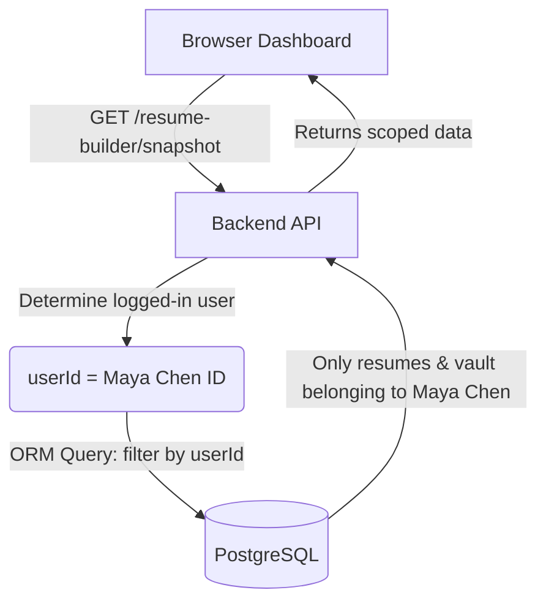

# Database Data Isolation & Single-Player Mode Report

This report explains the data architecture and isolation rules of the Universal Academic Portfolio System (UAPS). It breaks down why only a subset of the resumes, skills, and projects stored in the PostgreSQL database are displayed on the frontend at `http://localhost:3000`.

---

## 1. Summary of the Situation
The database container contains **12 resumes**, **51 skills**, and **13 projects** in total. However, when you visit `http://localhost:3000`, the dashboard only displays **5 resumes** (or 4 before your latest test), **21 skills**, and **3 projects**.

This behavior is **correct and intentional**. It is caused by two combined architectural designs:
1. **Multi-User Data Isolation (Multi-Tenancy):** The system isolates data per user. A logged-in user can only see and edit their own resumes, projects, skills, and experiences.
2. **Single-Player Mode (Local Dev Auto-Login):** In local development, the API runs in "Single-Player Mode" by default. It automatically logs you in as **Maya Chen** without requiring a GitHub login. Therefore, you are only seeing records belonging to Maya Chen.

---

## 2. Resource Breakdown per User in PostgreSQL

Below is a detailed breakdown of the records currently stored in your Docker PostgreSQL container, grouped by owner:

| User Name | Email | Resumes | Projects | Experiences | Active Session Status |
| :--- | :--- | :---: | :---: | :---: | :--- |
| **Maya Chen** | `maya.chen.demo@uaps.local` | **5** | **3** | **3** | **Active Dev User (Auto-logged in)** |
| **Napat Srisuk** | `napat.backend.demo@uaps.local` | **2** | **2** | **2** | Demo User |
| **Priya Natarajan** | `priya.natarajan.demo@uaps.local` | **2** | **3** | **3** | Demo User |
| **Rafael Ortiz** | `rafael.ortiz.demo@uaps.local` | **2** | **3** | **3** | Demo User |
| **Mali Chantarang** | `mali.ai.demo@uaps.local` | **1** | **2** | **2** | Demo User |
| **Anothai Vichapaiboon** | `anothai.0978452316@gmail.com` | **0** | **0** | **0** | Your Personal Account (via GitHub OAuth) |
| **TOTAL IN DATABASE** | — | **12** | **13** | **13** | — |

> [!NOTE]
> Out of the 12 total resumes, **5 belong to Maya Chen** (including `Test Resume from Agent` and `Agentic Software Engineer @ Company Z` created during the tests). The other 7 resumes belong to other demo users, so they are not loaded into Maya's dashboard.

---

## 3. Data Isolation Flow (How it is queried)

When the frontend loads the dashboard, it calls the `/v1/resume-builder/snapshot` API. The backend handles this query in `OrmVaultRepository.ts` by filtering every query by the `userId` in the session:



Specifically, inside [orm-vault.repository.ts](file:///d:/RepositoryVS/Project/universal_academic_portfolio_system_copy/apps/api/src/db/repositories/orm-vault.repository.ts#L75-L115):
```typescript
prisma.user.findUnique({ where: { userId } }),
prisma.userSkill.findMany({ where: { userId } }),
prisma.project.findMany({ where: { userId } }),
prisma.experience.findMany({ where: { userId } }),
prisma.certificate.findMany({ where: { userId } }),
prisma.award.findMany({ where: { userId } })
```
Since `userId` represents the active user, all query results are strictly isolated.

---

## 4. How to Switch Users to Verify Other Data

If you want to view resumes and vault data belonging to other demo users (like Napat, Mali, Rafael, or Priya), you can easily switch the active dev session in the code:

### Option A: Switch the Local Dev User
1. Open the [auth.ts](file:///d:/RepositoryVS/Project/universal_academic_portfolio_system_copy/apps/api/src/auth.ts#L34-L41) file.
2. Edit the `LOCAL_DEV_USER` constant to use the email of another demo user. For example, to switch to **Napat Srisuk**:
```typescript
const LOCAL_DEV_USER = {
  email: "napat.backend.demo@uaps.local", // Changed from maya.chen.demo@uaps.local
  name: "Napat Srisuk",
  githubId: "demo-napat-srisuk-001",
  githubLogin: "napat-srisuk-demo",
  githubUrl: "https://github.com/napat-srisuk-demo",
  avatarUrl: "https://avatars.githubusercontent.com/u/1001002?v=4",
} as const;
```
3. Refresh `http://localhost:3000/`. The API will automatically create/link the session to Napat, and you will see Napat's **2 resumes**, **projects**, and **experiences** on the dashboard.

### Option B: Turn off Single Player Mode to log in via GitHub
1. Open [apps/api/.env](file:///d:/RepositoryVS/Project/universal_academic_portfolio_system_copy/apps/api/.env).
2. Add the following environment variable:
```env
SINGLE_PLAYER_MODE=false
```
3. Restart `bun dev`.
4. Open `http://localhost:3000/` and sign in using your GitHub account.
5. This will log you in as `Anothai Vichapaiboon` (which currently has **0 resumes** in the database). You will see a clean dashboard where you can build your own resumes from scratch.
